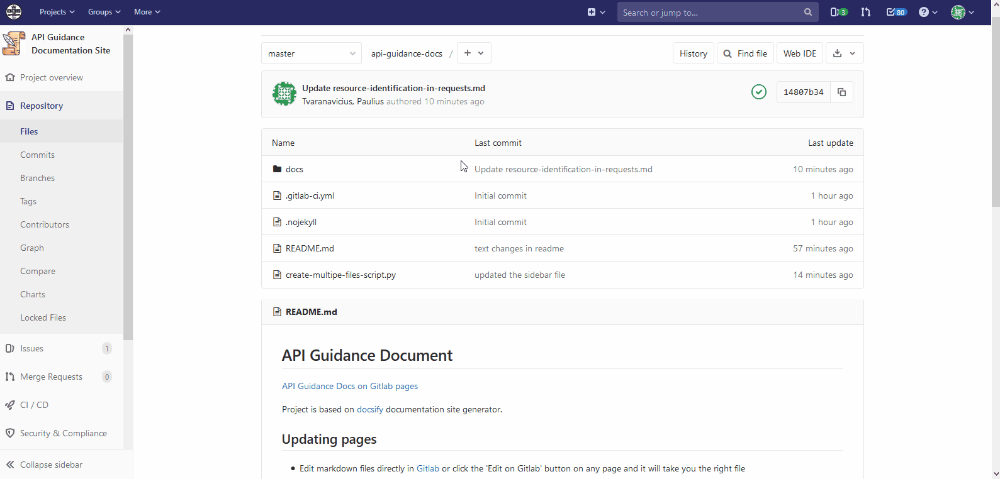

# Wireframes and Design Guides

[API Guidance Docs on Gitlab pages](http://apis.glpages.ad.nerc.ac.uk/api-guidance-docs)

Project is based on [docsify](https://docsify.js.org/) documentation site generator.

## Updating pages

* Edit markdown files directly in [Gitlab](https://kwvmxgit.ad.nerc.ac.uk/apis/api-guidance-docs/tree/master/docs) or click the 'Edit on Gitlab' button on any page and it will take you the right file
* Make your changes and commit (or submit a merge request for somebody else to review)
* Once the changes merge into master, the project will be deployed on [gitlab pages](http://apis.glpages.ad.nerc.ac.uk/api-guidance-docs)

<!---->

## Creating new pages

* Create a new markdown file in docs folder (e.g. `readonly-methods.md`)
* Add a line in the `_sidebar.md` to create a link to that file in the sidebar (e.g `-  [Readonly Methods](readonly-methods.md)`)
* Once the changes merge into master it will be deployed on [gitlab pages](http://apis.glpages.ad.nerc.ac.uk/api-guidance-docs)

## Rendering OpenAPI specification files in GitLab

GitLab can render OpenAPI specification files with its file viewer, provided their filenames include "openapi" or "swagger" and their extension is yaml, yml, or json.
The filename match is case-insensitive.

https://docs.gitlab.com/ee/user/project/repository/#openapi-viewer

## Running documentation locally

You can also run the project locally, make the changes and then submit your changes to gitlab.

* Install docsify: `npm i docsify-cli -g`
* Pull the project to your computer
* cd into api-guidance-docs
* Run the project - `docsify serve ./docs --open`
* Website will run on `http://localhost:3000/`

