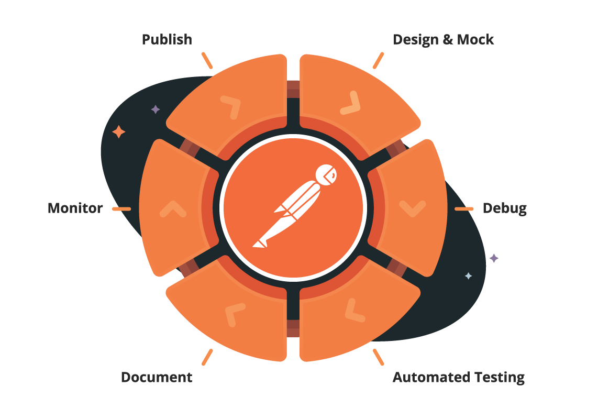

# Designing APIs

## Design process

("Design process overview" see comments from Chris on issue #20)

TODO

## Design considerations

The following constraints are the ideal for web API development from a functional perspective but not always from a business one. For example, if a feature is implemented that is never used then the resources spent on that feature can often be considered as wasted resources. For this reason, it is recommended that developers focus on a few quality endpoints that are 'Good Enough!' to satisfy the requirements.

The primary focus of development should be on design. A design developed solely to satisfy a set of requirements yet is not coupled with any particular consumer. A good design will be easily extendable with nice to have features later; when a more refined understanding of the different stakeholdings are known and appropriate resources are available. The design allows to iterate more easily and to perform what-if analysis. Also, making changes to the API in the design stage is much easier.

As an example, a web API designed with to service a single or multi page web service (SPA/MPA) where a user explores data, much like a set of HTML pages with hyperlinks to other pages, may find adhering to HATEOAS by providing a range of hyperlinks. An embedded web API for a very specific purpose will probably have little use for additional links; only implementing if a clear need arises.

## Best Practice

* [W3C - Data Access guidelines](https://www.w3.org/TR/dwbp/#dataAccess)
* [W3C - Data Access APIs guidelines](https://www.w3.org/TR/dwbp/#accessAPIs)
* [W3C - API example *as used in guidelines*](https://www.w3.org/TR/dwbp/dwbp-api-example.html)

## User research

In order to design an API that is useful and easy to use, it is important to understand the context in which it will be used and who will use it.

To get more clarity on the use-cases and requirements you can ask the following questions:

* Who is your API audience?
* What do they want from the API?
* How will they use the API?

Following the principles outlined in this documentation will help you:

1. Design the **right thing**
2. Design the **thing right**

## API user experience

> In the API space, we build something on a machine for a machine to use and this is wrong because there are people on the other side 
> of API clients.
>
> *- Ronnie Mitra*

To help make the developer user experience better you can follow the usability rules defined by [Peter Morville](https://semanticstudios.com/about/) known as [UX Honeycomb](https://semanticstudios.com/user_experience_design/).

1. **Useful**: Is the API useful from an end user’s point of view?
2. **Usable**: Can the API be quickly used by a developer and provide easy-to-use functionality?
3. **Desirable**: Is the functionality provided by the API something that generates desire in developers and end users?
4. **Findable**: Can the API documentation be found easily, and can developers start using it immediately?
5. **Accessible**: Can the API provide functionality for end users who have technical constraints/limitations in consuming it?
6. **Credible**: Is the data provided by the API trustworthy?
7. **Valuable**: Does the API contribute to the company’s bottom line and improve customer satisfaction?

## Architectural constraints
These constraints restrict the ways that the server should process and respond to client requests so that, by operating within these constraints, the service gains desirable non-functional properties, such as performance, scalability, simplicity, modifiability, visibility, portability, and reliability.

Source: all constraints are adaptation of [Representational state transfer REST](https://en.wikipedia.org/wiki/Representational_state_transfer)

### Client-server architecture
The client–server model is a distributed application structure that partitions tasks or workloads between the providers of a resource or service, called servers, and service requesters, called clients.

Source: [Client–server model](https://en.wikipedia.org/wiki/Client-server_model)

### Statelessness
The client–server communication is constrained by no client context being stored on the server between requests. Each request from any client contains all the information necessary to service the request, and session state is held in the client.

### Cacheability
As on the World Wide Web, clients and intermediaries can cache responses. Responses must therefore, implicitly or explicitly, define themselves as cacheable or not to prevent clients from reusing stale or inappropriate data in response to further requests. Well-managed caching partially or completely eliminates some client–server interactions, further improving scalability and performance.

### Layered system
A client cannot ordinarily tell whether it is connected directly to the end server, or to an intermediary along the way. Intermediary servers may improve system scalability by enabling load balancing and by providing shared caches. They may also enforce security policies.

### Resource identification in requests
Individual resources are identified in requests. The resources themselves are conceptually separate from the representations that are returned to the client.

### Resource manipulation through representations
When a client holds a representation of a resource, including any metadata attached, it has enough information to modify or delete the resource (if it's a deletable resource).

### Self-descriptive messages
Each message includes enough information to describe how to process the message.

### HATEOAS: Hypermedia as the engine of application state
Having accessed an initial URI for the application a client should then be able to use server-provided links dynamically to discover all the available actions and resources it needs. As access proceeds, the server responds with text that includes hyper-links to other actions that are currently available. There is no need for the client to be hard-coded with information regarding the structure or dynamics of the service.

## External Links

*  [Representational state transfer REST](https://en.wikipedia.org/wiki/Representational_state_transfer)
*  [Client–server model](https://en.wikipedia.org/wiki/Client-server_model)
*  [Internet Date/Time Format RFC3339 / ISO8601](https://xml2rfc.tools.ietf.org/public/rfc/html/rfc3339.html#anchor14)
*  [Hypertext Transfer Protocol (HTTP/1.1): Semantics and Content RFC7231](https://tools.ietf.org/html/draft-ietf-httpbis-p2-semantics-26)
*  [OpenAPI Specification 3.0.3](https://swagger.io/specification/)
*  [JSON Schema](https://json-schema.org/specification.html)
