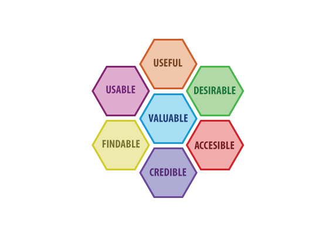

# Designing APIs

## New Section

(Design "overview" - not sure of title - see comments from Chris on issue #20)

## User research

In order to design an API that is useful and easy to use, it is important to understand the context in which it will be used and who will use it.

To get more clarity on the use-cases and requirements you can ask the following questions:

* Who is your API audience?
* What do they want from the API?
* How will they use the API?

Following the principles outlined in this documentation will help you:

1. Design the **right thing**
2. Design the **thing right**

## API user experience

> In the API space, we build something on a machine for a machine to use and this is wrong because there are people on the other side 
> of API clients.
>
> *- Ronnie Mitra*

To help make the developer user experience better you can follow the usability rules defined by [Peter Morville](https://semanticstudios.com/about/) known as [UX Honeycomb](https://semanticstudios.com/user_experience_design/).

1. **Useful**: Is the API useful from an end user’s point of view?
2. **Usable**: Can the API be quickly used by a developer and provide easy-to-use functionality?
3. **Desirable**: Is the functionality provided by the API something that generates desire in developers and end users?
4. **Findable**: Can the API documentation be found easily, and can developers start using it immediately?
5. **Accessible**: Can the API provide functionality for end users who have technical constraints/limitations in consuming it?
6. **Credible**: Is the data provided by the API trustworthy?
7. **Valuable**: Does the API contribute to the company’s bottom line and improve customer satisfaction?

## Architectural constraints
These constraints restrict the ways that the server should process and respond to client requests so that, by operating within these constraints, the service gains desirable non-functional properties, such as performance, scalability, simplicity, modifiability, visibility, portability, and reliability.

Source: all constraints are adaptation of [Representational State Transfer][representational-state-transfer]

### Client-server architecture
The client–server model is a distributed application structure that partitions tasks or workloads between the providers of a resource or service, called servers, and service requesters, called clients.

Source: [Client server model][client-server-model]

### Statelessness
The client–server communication is constrained by no client context being stored on the server between requests. Each request from any client contains all the information necessary to service the request, and session state is held in the client.

### Cacheability
As on the World Wide Web, clients and intermediaries can cache responses. Responses must therefore, implicitly or explicitly, define themselves as cacheable or not to prevent clients from reusing stale or inappropriate data in response to further requests. Well-managed caching partially or completely eliminates some client–server interactions, further improving scalability and performance.

### Layered system
A client cannot ordinarily tell whether it is connected directly to the end server, or to an intermediary along the way. Intermediary servers may improve system scalability by enabling load balancing and by providing shared caches. They may also enforce security policies.

### Resource identification in requests
Individual resources are identified in requests. The resources themselves are conceptually separate from the representations that are returned to the client.

### Resource manipulation through representations
When a client holds a representation of a resource, including any metadata attached, it has enough information to modify or delete the resource (if it's a deletable resource).

### Self-descriptive messages
Each message includes enough information to describe how to process the message.

### HATEOAS: Hypermedia as the engine of application state
Having accessed an initial URI for the application a client should then be able to use server-provided links dynamically to discover all the available actions and resources it needs. As access proceeds, the server responds with text that includes hyper-links to other actions that are currently available. There is no need for the client to be hard-coded with information regarding the structure or dynamics of the service.

## Web API versioning
If there is a new version then consumers should expect that the whole API may have completely changed, from endpoint URLs to response formats. A new (major) version could, from another perspective, just be seen as a completely new web API. Thus a version 2 is no different from a new API which does the same thing.

There is the possibility that data versioning will be added to many datasets. From an end users perspective, multiple versions that need to provided together gives data navigation a lot more complex. This would also mean internal developers may have to support many different versions of an API where each is supporting different data versions. This will almost likely cause a lot of confusion and maintenance difficulties. For these reasons we thought best to only use minor versioning; for our web APIs at least.

### Majorless versioning
With majorless versioning the __major version number never changes or doesn't exist__. API breaking changes should be avoided at all costs, the majorless versioning approach helping to enforce this. When an API breaking change does occur it is usually because a new feature really can't fit due to bad initial API design or that the whole concept or purpose of the API has changed; both very suggestively point at the creation of a new API.

For many small changes and corrections new endpoints should be considered first, unless of course, almost all of the end points need to change; in which case a new web API might be appropriate. Adding a new endpoint and deprecating the previous one is also a common tactic to avoid going through the process of releasing a whole new version/API for just adding a new feature.

### Additions and bug fixes
Minor changes are those where the web API has been extended, perhaps with new endpoints or maybe new properties have been added to the responses. Patch changes are generally bug fixes. A change of either type should not break or change, in anyway, __correctly implemented__ front ends; if it does then its an API breaking change and thus a new API is required (or figure an alternative way to make the change).

### New web API name suggestions
A new name for the new web API will need to be considered but it shouldn't be too much hassle. As an example, here are some alternative names for the _'/gtf'_ (Geochronology and tracers facility) web API:
* _'/gtf2'_
* _'/geotf'_
* _'/geotrace'_
* _'/gtf-next-generation'_
* _'/gtf9000'_

_'/gtf2'_ suggests to users that it is the second version, which is absolutely fine and after considering the way people refer to popular software this is possible the best way forward. The _'2'_ is part of the name and does not have the same semantic meaning that a major version number has. Big software companies use this approach and you often find the number on the front of the box doesn't match the actual product version. For example, Windows 8 has the official version number 6.2. Perhaps they are coming at it from a marketing perspective but the idea is the same, to distinctly separate products.

## External Links

*  [Representational state transfer REST](https://en.wikipedia.org/wiki/Representational_state_transfer)
*  [Client–server model](https://en.wikipedia.org/wiki/Client-server_model)
*  [Internet Date/Time Format RFC3339 / ISO8601](https://xml2rfc.tools.ietf.org/public/rfc/html/rfc3339.html#anchor14)
*  [Hypertext Transfer Protocol (HTTP/1.1): Semantics and Content RFC7231](https://tools.ietf.org/html/draft-ietf-httpbis-p2-semantics-26)
*  [OpenAPI Specification 3.0.3](https://swagger.io/specification/)
*  [JSON Schema](https://json-schema.org/specification.html)
