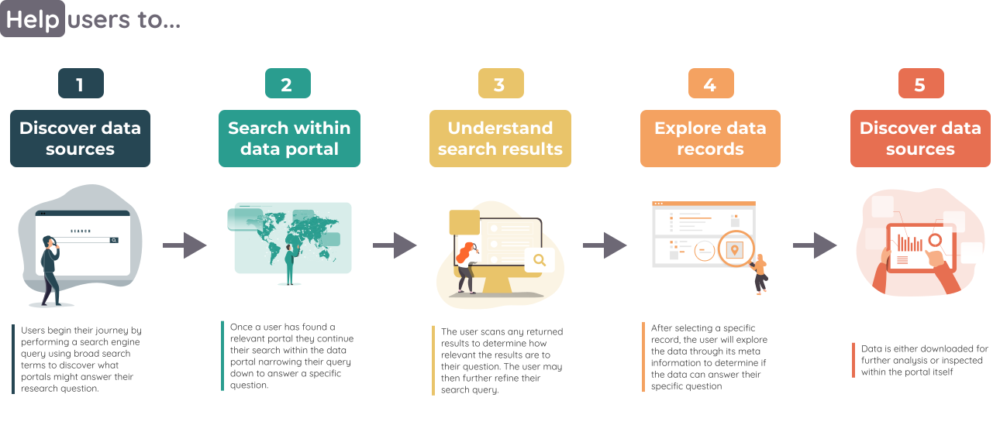
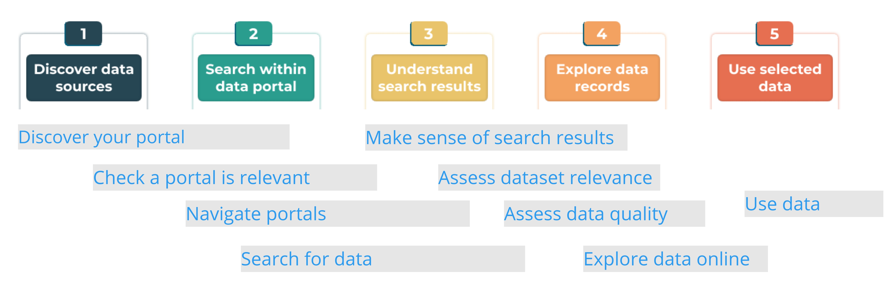
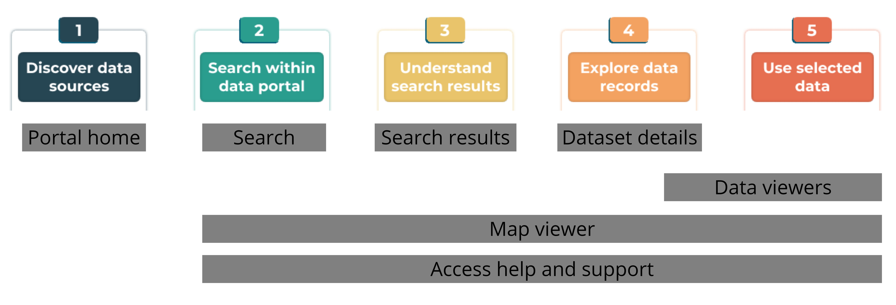

# Spatial data portals

Increase the discoverability and usefulness of spatial data by designing data portals that satisfy user needs. 

Data portals differ by the data they provide and the audiences they serve, so these recommendations are general and focus on designs to address the frustrations that users experience at different stages of their data discovery journey.

## Everything happens somewhere
Location is a fundamental aspect of many data and being able to combine and integrate seemingly diverse datasets using locality can provide powerful insights. 

Although more and more spatial data is being made available online, there there are users who are confused about where to go, who to trust and which datsets are most relevant to answering their questions.       

In 2018 user researchers and designers across the <u>Geo6</u> came together to explore the needs and frustrations experienced by the users of data portals containing spatial data.

Throughout 2019 the Geo6 have worked on solutions to address the pain points identified in the <u>DD2 report</u>.

## User journey
Users discover, access and interact with data portals in a range of ways depending on what they are trying to achive, who they are and whether they are a first time vistor or a regular user. We have identifed five broad stages of most user journeys. Below is the archetypical journey people might go through in their search for data. It doesn’t mean that every user will go through the same stages, but they represent the steps the majority of people would have to complete in order to find, get access and make use of spatial data. 

### Help users to...
//To do: Describe how certain tasks occur along the user journey and how our recomendations can address known pain points  

### Key pages
//To do: Write this up 

## Common painpoints for users
User research conducted on behalf of the Geospatial Commision identifed many issues that led to users being confused and frustrated. Poor usability and functionality reduces trust and impact of potentially valuable data. 

Our recommendations are designed to address the following painpoints:  
1. Discover data sources
* The right keywords or jargon to use
* Lack of domain knowledge when searching
* Reliance on colleagues to provide data and sources.
* Unclear signage
* Difficult to understand where data originates from.
* Multiple sources
2. Search within data portal
* User interface allows limited search functionality
* Not knowing the best terminology
* Inadequate filtering options - reset issues
* Usability documentation is unhelpful
* Require more temporal and flexible search parameters.
3. Understand search results
* Poor or invalid descriptions
* Overwhelming amount of results / data returned
* Multiple results contain the same data
* Ranking by “best match” did not match user expectations
* Frequency of search term per record is a bad descriptor of rank
* Misinformation within data sets
* Off the shelf search / sort and filter algorithms are often inadequate
* Acronyms are difficult to interpret and understand
4. Explore data records
* Poor or invalid descriptions
* Overwhelming amount of data returned
* Same data from multiple sources
* Ranking by best match did not match user expectations
* Frequency of search term in a record is a bad descriptor
* Misinformation within data set
* Off the shelf search algorithms are inadequate
* Acronyms are difficult to understand and interpret
5. Use selected data
* Mixed and variable formats
* Not mobile friendly
* Too many steps restricting access
* Different standards
* No API access
* Licensing restrictions
* Reliance on others for interpretation
* Character corruption
