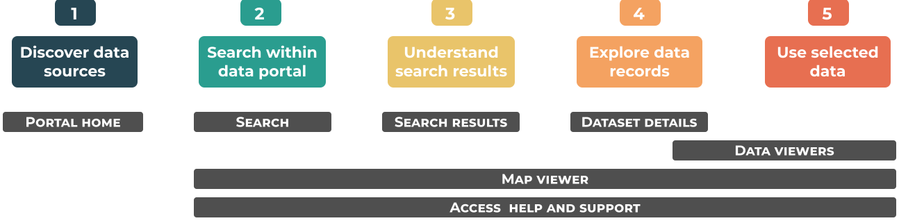

# Spatial data portals

Increase the discoverability and usefulness of spatial data by designing data portals that satisfy user needs. 

Data portals differ by the data they provide and the audiences they serve, so these recommendations are general and focus on designs to address the frustrations that users experience at different stages of their data discovery journey. For the purposes of this work, data portals are described as web-based interfaces designed to help users find and access datasets. Optimally, they should be built around metadata records which describe datasets, provide pointers to where they can be located and explain any restrictions or limitations in their use. 

Everything happens somewhere. Location is a fundamental aspect of many data and being able to combine and integrate seemingly diverse datasets using locality can provide powerful insights. 

Although more and more spatial data is being made available online, there there are users who are confused about where to go, who to trust and which datsets are most relevant to answering their questions.       

In 2018 user researchers and designers across the <u>Geo6</u> came together to explore the needs and frustrations experienced by the users of data portals containing spatial data.

Throughout 2019 the Geo6 have worked on solutions to address the pain points identified in the <u>DD2 report</u>.

## Research your users
We are presenting highlevel generic recommendations but the exact requirements for any given portal will vary according to the data volumes and subject matters covered as well as the needs of your targget audience. This resource is not a replacement for portal specific user research and design work.  

## User journey
Users discover, access and interact with data portals in a range of ways depending on what they are trying to achive, who they are and whether they are a first time vistor or a regular user. We have identifed five broad stages of most user journeys. Below is the archetypical journey people might go through in their search for data. It doesn’t mean that every user will go through the same stages, but they represent the steps the majority of people would have to complete in order to find, get access and make use of spatial data. 

## Common painpoints for users
User research conducted on behalf of the Geospatial Commision identifed many issues that led to users being confused and frustrated. Poor usability and functionality reduces trust and impact of potentially valuable data. 

Our recommendations are designed to address the following painpoints, grouped by user journey stage:  

### 1. Discover data sources
*	Lack of domain knowledge when searching
*	Uncertainty about which keywords to use in search engine
*	Reliance on personal recommendations rather than search engine results
*	Unclear inconsistent way to navigate a portal 
*	Difficulty understanding where data originates from
*	No one portal contains all the required data

### 2. Search within data portal
*	Not knowing the best terminology to use
*	User interface allows limited search functionality
*	Not enough granularity when looking to filter search results
*	Require more temporal and flexible search parameters
*	Usability documentation is unhelpful

### 3. Understand search results
*	Overwhelming amount of results / data returned
*	Multiple results contain the same data
*	Poor or invalid descriptions
*	Misinformation within data sets
*	Acronyms are difficult to interpret and understand
*	Inconsistent searching and sorting filters present unexpected search results
*	Presenting search results by best match (ranked by frequency of keywords per record for a given search query), does not match the user’s expectation of ranked search results
*	Clarity on how search results are ordered is often misunderstood

### 4. Explore data records
*	No online preview of data
*	Data formats are not clearly defined or structured
*	Metadata titles are not written in plain English
*	It is not clear what ‘last updated’ means
*	Cannot create a custom download
*	Lack of information about licences and terms of use
*	Titles and summaries are not informative
*	Lack of details about who to contact for further information and support
*	Lack of clarity on where the data originates from
*	Lack of trust for data that originates from non-governmental organisations

### 5. Use selected data
*	Data is not available in the formats users prefer 
*	Data viewers and exploration option are not optimised for mobile display
*	Too many barriers such as user registration required pre-download
*	Different standards //NEED TO CLARIFY
*	No API access
*	Licencing restrictions
*	Reliance on others for interpretation
*	Character corruption within data or metadata

### Help users to...
As users progress therough their journey, they perform certain tasks, some spanning more than one of the high level stages (described above). Our recomendations in the Help Users To... section address each of these user needs, for example [Helps User To... Discover your portal](main-content/steps/discover-your-portal) .   

### Key pages
We have also provided guidance on design considerations for a selction of key portal pages such ast the [Homepage](main-content/pages/homepage) within the Pages section.

