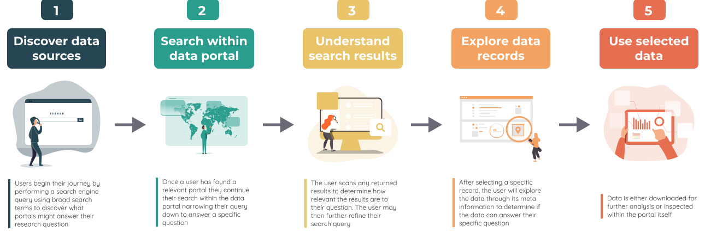
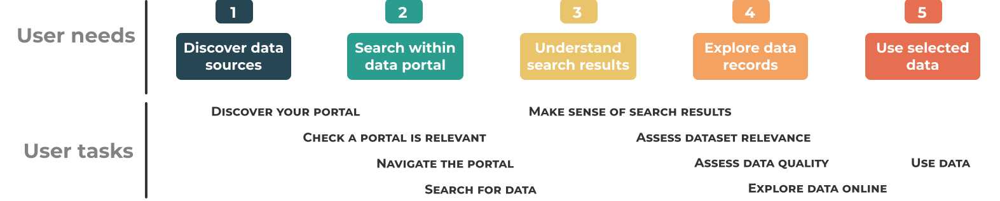
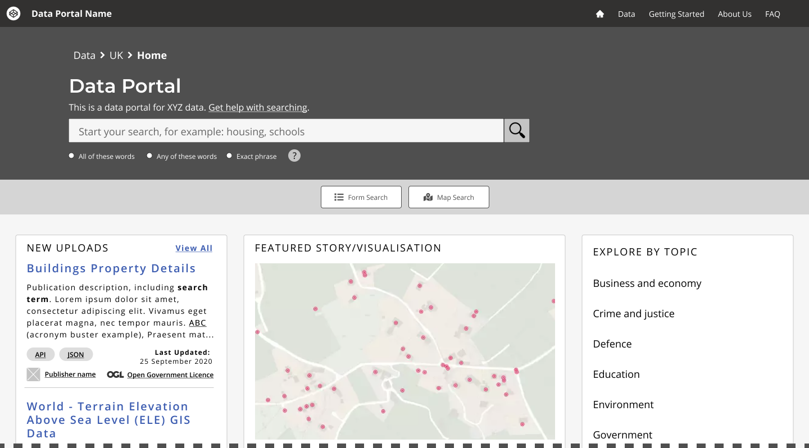

# Designing geospatial data portals

> Guidance for developers and designers to increase the discoverability and usefulness of geospatial data through user focussed data portals.

## Geospatial data portals

Data portals differ by the data they provide and the audiences they serve. 'Data portals' described within this guidance are web-based interfaces designed to help users find and access datasets. Optimally, they should be built around metadata records which describe datasets, provide pointers to where they can be located and explain any restrictions or limitations in their use.

Although more and more geospatial data is being made available online, there are users who are confused about where to go, who to trust and which datasets are most relevant to answering their questions.

In 2018 user researchers and designers across the Geo6 came together to explore the needs and frustrations experienced by users of data portals containing geospatial data.

Throughout 2019 and 2020 the Geo6 have worked on solutions to address pain points identified by the user research conducted for the [Data Discoverability project](https://www.gov.uk/government/publications/finding-geospatial-data/finding-geospatial-data).

!> This guidance material is not intended to be used as a comprehensive design system for all aspects of geospatial portals. There is no re-usable code or in-depth style guide provided. If such resources are of interest please visit the [GOV.UK Design System](https://design-system.service.gov.uk/get-started/).

## Research your users
This guidance provides high level general recommendations, however, exact requirements for any given portal will vary depending on the needs of your target audience and according to the data volumes and subject matters covered. This resource is not a replacement for portal specific user research and design work. 

## User journey
Everything happens somewhere. Geospatially referenced data can provide powerful insights when combining the application of data and locality. 

Users often require information and data from a variety of sources in order to achieve their ultimate goal. Users will discover, access and interact with data portals in a range of ways depending on what they are trying to achieve, who they are and whether they are a first time visitor or a regular user. We have identified five high level user needs that make up the archetypical user journey people go through when searching for data. It doesn’t mean that every user will have the same needs in the same order, but they represent the needs expressed by the majority of people who contributed to our research. 

## Common pain points for users
User research conducted on behalf of the Geospatial Commission identified many issues that caused users to be confused or frustrated when [Finding Geospatial Data](https://www.gov.uk/government/publications/finding-geospatial-data/finding-geospatial-data). Poor usability reduces trust and limits the impact of potentially valuable data. 

Our recommendations are designed to address the following pain points, grouped by user needs:  

### 1. Discover data sources
*	Lack of domain knowledge when searching
*	Uncertainty about which keywords to use in a search engine
*	Reliance on personal recommendations rather than search engine results
*	Unclear or inconsistent ways to navigate a portal 
*	Difficulty understanding where data originates from
*	No single portal contains all the required data

### 2. Search within data portal
*	Not knowing the best terminology to use
*	User interface allows limited search functionality
*	Not enough granularity when looking to filter search results
*	Require more temporal and flexible search parameters
*	Usability documentation is unhelpful

### 3. Understand search results
*	Overwhelming amount of results / data returned
*	Multiple results contain the same data
*	Poor or invalid descriptions
*	Misinformation within data sets
*	Acronyms are difficult to interpret and understand
*	Inconsistent searching and sorting filters present unexpected search results
*	Presenting search results by best match (ranked by frequency of keywords per record for a given search query), does not match the user’s expectation of ranked search results
*	Clarity on how search results are ordered is often misunderstood

### 4. Explore data records
*	No online preview of data
*	Data formats are not clearly defined or structured
*	Metadata titles are not written in plain English
*	It is not clear what ‘last updated’ means
*	Cannot create a custom download
*	Lack of information about licences and terms of use
*	Titles and summaries are not informative
*	Lack of details about who to contact for further information and support
*	Lack of clarity on where the data originates from
*	Lack of trust for data that originates from non-governmental organisations

### 5. Use selected data
*	Data is not available in the formats users prefer 
*	Data viewers and exploration option are not optimised for mobile display
*	Too many barriers such as user registration required pre-download
*	Different standards of metadata between records
*	No API access
*	Licencing restrictions
*	Reliance on others for interpretation
*	Character corruption within data or metadata

## Help users to...
As users progress through their journey, they perform certain tasks, some spanning more than one high level user need (see below). This guidance presents solutions in a format that addresses those pain points. These solutions are phrased as a statement to 'Help Users To...' perform tasks, for example [Helps User To... Discover your portal](main-content/steps/discover-your-portal) .   

## Wireframes

This guidance features mock components and page illustrations as a general wireframe for a generic geospatial data portal. 

Wireframes are visual representations of the user interface without branding or high fidelity styles. Their purpose is to assist user experience (UX) designers to convey the overall presentation of page elements, their hierarchy and layout. The user needs for geospatial data portals were discovered in the [Data Discoverability project](https://www.gov.uk/government/publications/finding-geospatial-data/finding-geospatial-data).

Wireframes in this guidance shows one possible implementation of a geospatial portal. Each geospatial data portal will differ depending on the needs of their users.

The example wireframes can be found in the [example pages section](/main-content/pages/pages-intro).

*Example wireframe for a geospatial data portal's homepage*
