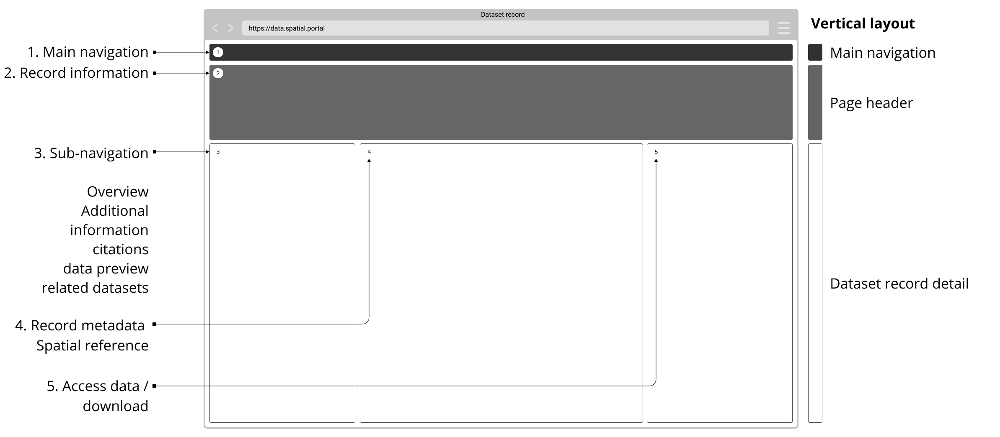

# Dataset details 

> Dataset details provide users access to each individual dataset record with enough information for them to assess the quality and relevance of the data. This information should be presented clearly with sub-sections as not to overwhelm the user with dense content.

## Example page for a dataset

*Example wireframe for dataset details page*

<!-- tabs:start -->

*Dataset overview*

*Additional dataset information*

*Dataset citation*

*Dataset preview*

*Related datasets*

## Components used in this example

**[Assess dataset relevance](/main-content/steps/assess-dataset-relevance)**
* [Clear dataset title](/main-content/steps/assess-dataset-relevance?id=_1-clear-dataset-title)
* [Short description](/main-content/steps/assess-dataset-relevance?id=_2-short-description)
* [Topics](/main-content/steps/assess-dataset-relevance?id=_3-topics)
* [Publisher name](/main-content/steps/assess-dataset-relevance?id=_4-publisher-name)
* [Licence details](/main-content/steps/assess-dataset-relevance?id=_5-licence-details)
* [Created on date](/main-content/steps/assess-dataset-relevance?id=_6-created-on-date)
* [Lasted updated date](/main-content/steps/assess-dataset-relevance?id=_7-lasted-updated-date)
* [Download link](/main-content/steps/assess-dataset-relevance?id=_8-download-link)
* [Additional metadata](/main-content/steps/assess-dataset-relevance?id=_9-additional-metadata)

**[Assess data quality](main-content/steps/assess-data-quality)**
* [Organization that produced the dataset should be clearly visible](/main-content/steps/assess-data-quality?id=_1-organization-that-produced-the-dataset-should-be-clearly-visible)
* [Last updated date and frequency of update](/main-content/steps/assess-data-quality?id=_2-last-updated-date-and-frequency-of-update)

**[Explore data online](/main-content/steps/explore-data-online)**
* [Preview data](/main-content/steps/explore-data-online?id=_1-preview-data)
* [Visualize data](/main-content/steps/explore-data-online?id=_2-visualize-data)
* [Get specific information online](/main-content/steps/explore-data-online?id=_3-get-specific-information-online)

**[Use data](main-content/steps/use-data)**
* [Download button](/main-content/steps/use-data?id=_1-download-button)
* [Clear licencing information](/main-content/steps/use-data?id=_2-clear-licencing-information)
* [Display data formats](#/main-content/steps/use-data?id=_3-display-data-formats)
* [API Access](/main-content/steps/use-data?id=_4-api-access)
* [File selection for partial downloads](/main-content/steps/use-data?id=_5-file-selection-for-partial-downloads)
* [Sharing options](/main-content/steps/use-data?id=_6-sharing-options)

<!--

Essential components

 
Below is a checklist of components/information that are relevant for this task.
These components can be arranged in many ways, but the ones with highest relevance should be the most visible/accessible.
?> 1 - high relevance, 2 - medium relevance, 3 - low relevance
-->
<!-- Table of component start -->
<!--
| Component             | Description                                                                                                   | Relevance |
|-----------------------|---------------------------------------------------------------------------------------------------------------|:---------:|
| Title                 | Descriptive but not too long                                                                                  |     1     |
| Description / Summary | A brief summary of the dataset outlining what is included in the dataset and for what purpose it was created. |     1     |
| Topics                | Dataset topics which allow users to easily jump to them                                                       |     1     |
| Organization name     | Organization that produced the dataset                                                                        |     1     |
| Last updated          | When was the dataset updated last. Possibly a changelog if available                                          |     1     |
| Created on            | When was the dataset created                                                                                  |     1     |
| Data explorer         | An ability to preview the files included in the dataset and to select which ones to download                  |     3     |
| Data preview          | An ability to preview the dataset in map, table or graph                                                      |     3     |
| Related datasets      | Datasets related by topic, proximity or any other suitable property                                           |     2     |
| Location preview      | Pin on the map or a polygon showing the geographical extent of the data                                       |     2     |
| Citation details      | Details on how the dataset should be cited                                                                    |     2     |
| Home link             | Easy way to get back to data portal's homepage                                                                |     2     |
| Search bar            | An easy way to search for other dataset within the same portal                                                |     3     |

-->
