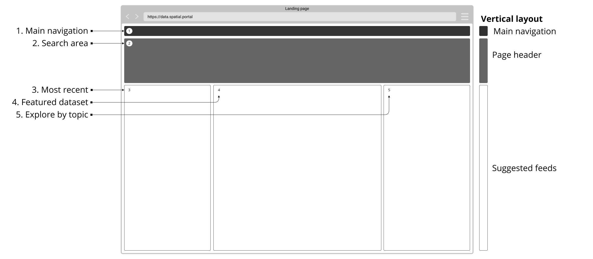
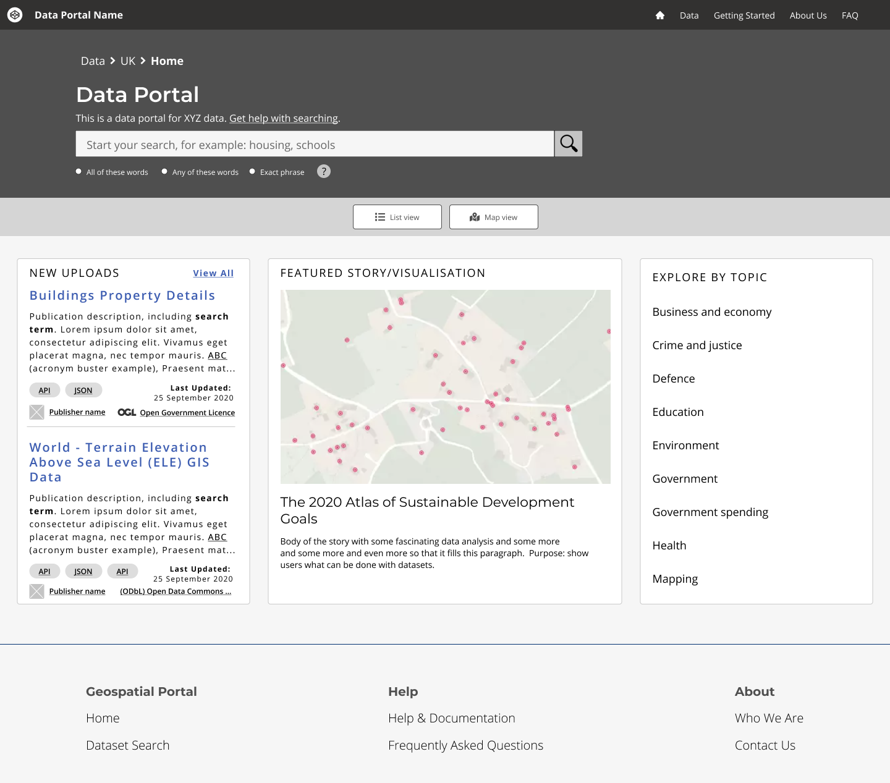

# Homepage

> The homepage should help users understand whether the data portal is relevant for their needs, what topics it covers, what licence the data is shared under and how to start their search for data.

## Example homepage

*Example wireframe for data portal's homepage*

 

*Example homepage*

 

*Example homepage with annotations*

## Components used in this example

The following lists provide a quick set of hyperlinks to associated user needs and guidance on how to help users to achieve related tasks.

**[Discover your portal](main-content/steps/discover-your-portal)**
<!-- typo in the link url -->

**[Chcck if a portal is relevant](main-content/steps/check-a-portal-is-relevant)**
* [What is the purpose of this data portal, what are the topics it covers?](/main-content/steps/check-a-portal-is-relevant?id=_1-what-is-the-purpose-of-this-data-portal-what-are-the-topics-it-covers)
* [Who is the organisation managing this portal?](/main-content/steps/check-a-portal-is-relevant?id=_2-who-is-the-organisation-managing-this-portal)
* [What licences are the data shared under?](#/main-content/steps/check-a-portal-is-relevant?id=_2-who-is-the-organisation-managing-this-portal)
* [What licences are the data shared under?](/main-content/steps/check-a-portal-is-relevant?id=_3-what-licences-are-the-data-shared-under)
* [Where do users start searching/exploring the data?](/main-content/steps/check-a-portal-is-relevant?id=_4-where-do-users-start-searchingexploring-the-data)
* [Help users navigate to homepage](/main-content/steps/check-a-portal-is-relevant?id=_5-help-users-navigate-to-homepage)

**[Navigate the portal](main-content/steps/search-for-data)**

* [Search field](/main-content/steps/search-for-data?id=_1-search-field)
* [Display search field prominently](/main-content/steps/search-for-data?id=_2-display-search-field-prominently)
* [Provide tips on what users can search for](/main-content/steps/search-for-data?id=_3-provide-tips-on-what-users-can-search-for)
* [Show search history](/main-content/steps/search-for-data?id=_4-show-search-history)
* [Don’t return no results](/main-content/steps/search-for-data?id=_5-dont-return-no-results)
* [Sort by and filter options](/main-content/steps/search-for-data?id=_6-sort-by-and-filter-options)
* [Show users’ search query on the results page](/main-content/steps/search-for-data?id=_7-show-users-search-query-on-the-results-page)
