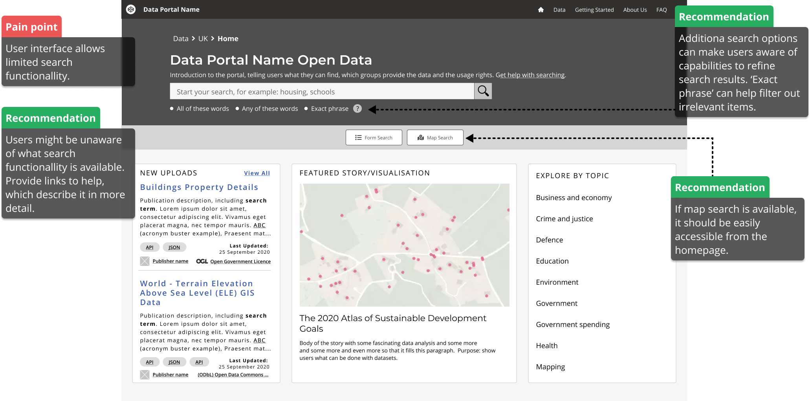

# Homepage

> The homepage should help users understand whether the data portal is relevant for their needs, what topics it cover, what licence the data is shared under and how to start their search for data.

## What it looks like

*Essential homepage elements*

*Homepage example with annotations*

<!-- tabs:start -->

<!-- #### **Wireframe**

 -->

<!--  -->

<!-- #### **Example**

 -->

<!--  -->

<!-- #### **Example with comments**

 -->

<!--  -->

<!-- tabs:end -->

## What tasks should the users be able to complete on this page?

* [Check a portal is relevant](/main-content/steps/check-a-portal-is-relevant)

