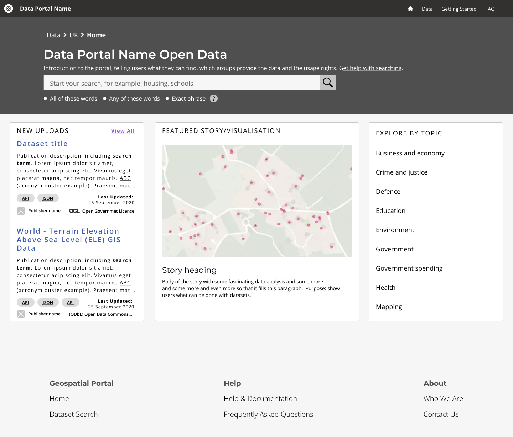

# Homepage

> The search page should help users to quickly query the data contained within the portal and return relevant results ranked by data quality. This information should be presented concisely and and clearly, highlighting relevant search terms, parent categories, sorting options and filters appropriate to the user.

## What it looks like

*Essential search and search results elements*

*Search and search results pages with annotations*

<!-- tabs:start -->

<!-- #### **Wireframe**

 -->

<!--  -->

<!-- #### **Example**

 -->

<!--  -->

<!-- #### **Example with comments**

 -->

<!--  -->

<!-- tabs:end -->

## What tasks should the users be able to complete on this page?

* [search for data](main-content/steps/search-for-data)
* [Make sense of search results](main-content/steps/make-sense-of-search-results)

