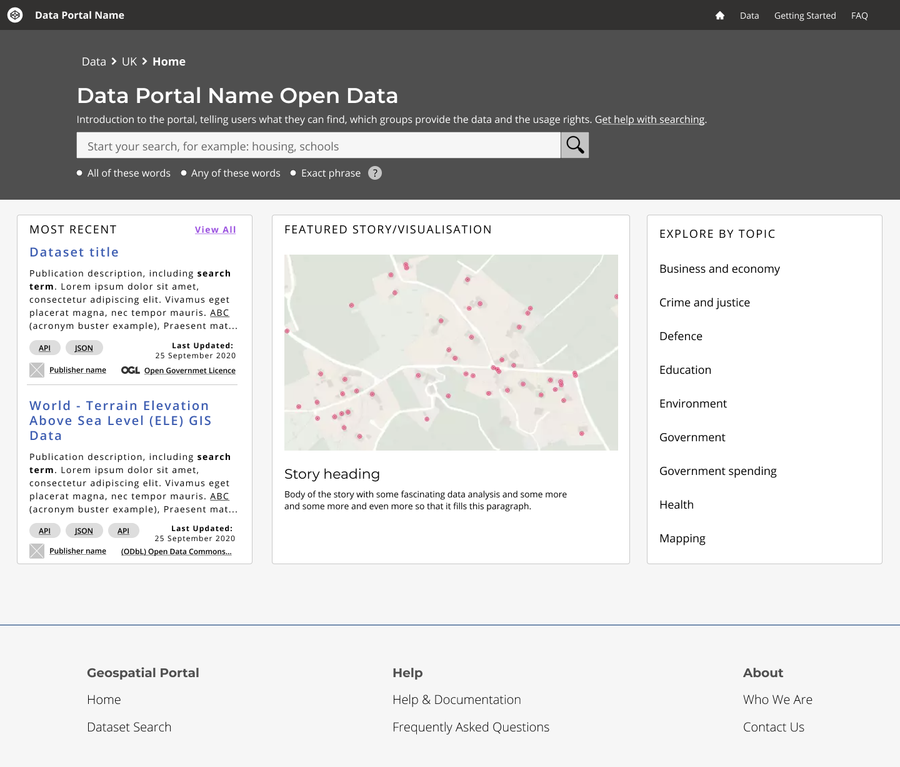
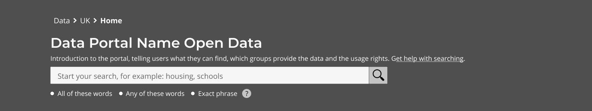
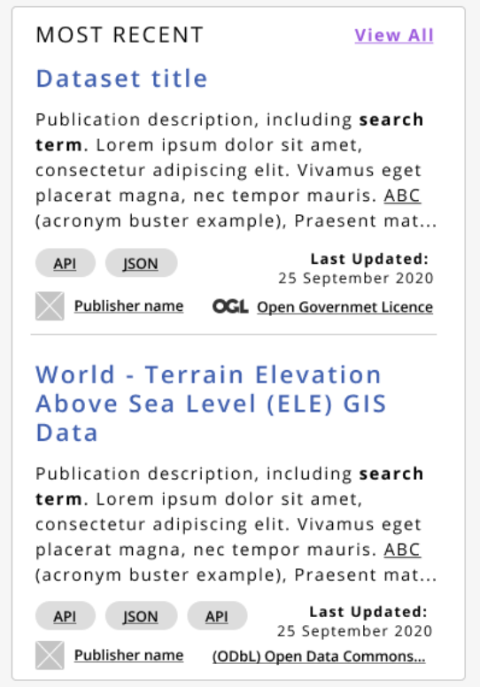
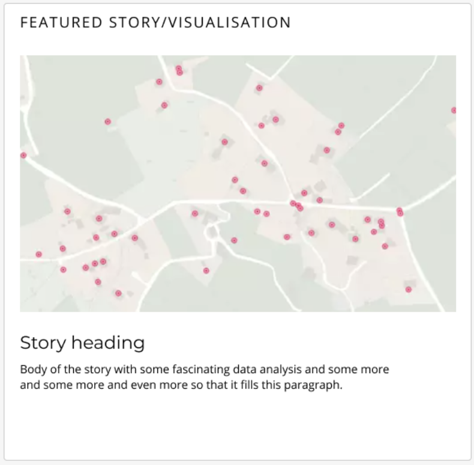
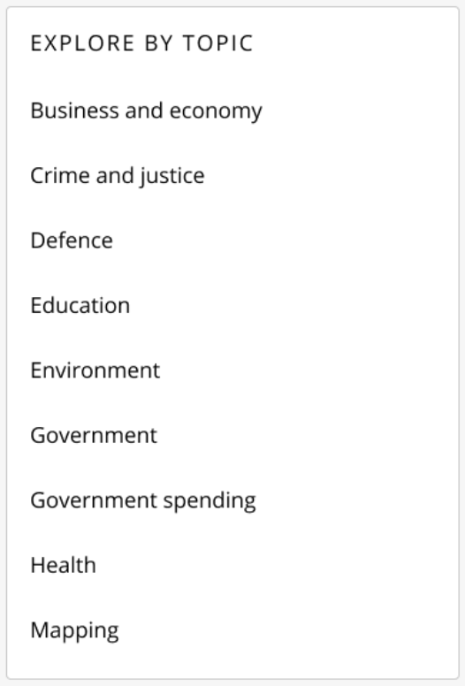

#### Guidance
# Help users to: search withn a portal

> This refers to being inside the data portal. The ‘Search screen’. How to use the site, the layout, keywords, filters etc.

## Pain points

- User interface allows limited search functionality
- Not knowing the best terminology 
- Inadequate filtering options - reset issues
- Usability documentation is unhelpful
- Require more temporal and flexible search parameters.

## Design patterns
### Overview

1. Navigation bar
2. Header search area
   -  a. Input field
   -  b. Sorting method
   -  c. Filtering
  
3. Most recent
4. Featured data set
5. Explore data sets

### Component by component 

1. Navigation bar

2. Header search area

3. Most recent

4. Featured data set

5. Explore data sets

### When to use this pattern

Use this pattern for areas of the website where a user needs to quickly search for information. For example, landing pages.

## Related research for this pattern

ThRead the blog post about *testing and iterating this pattern*.

