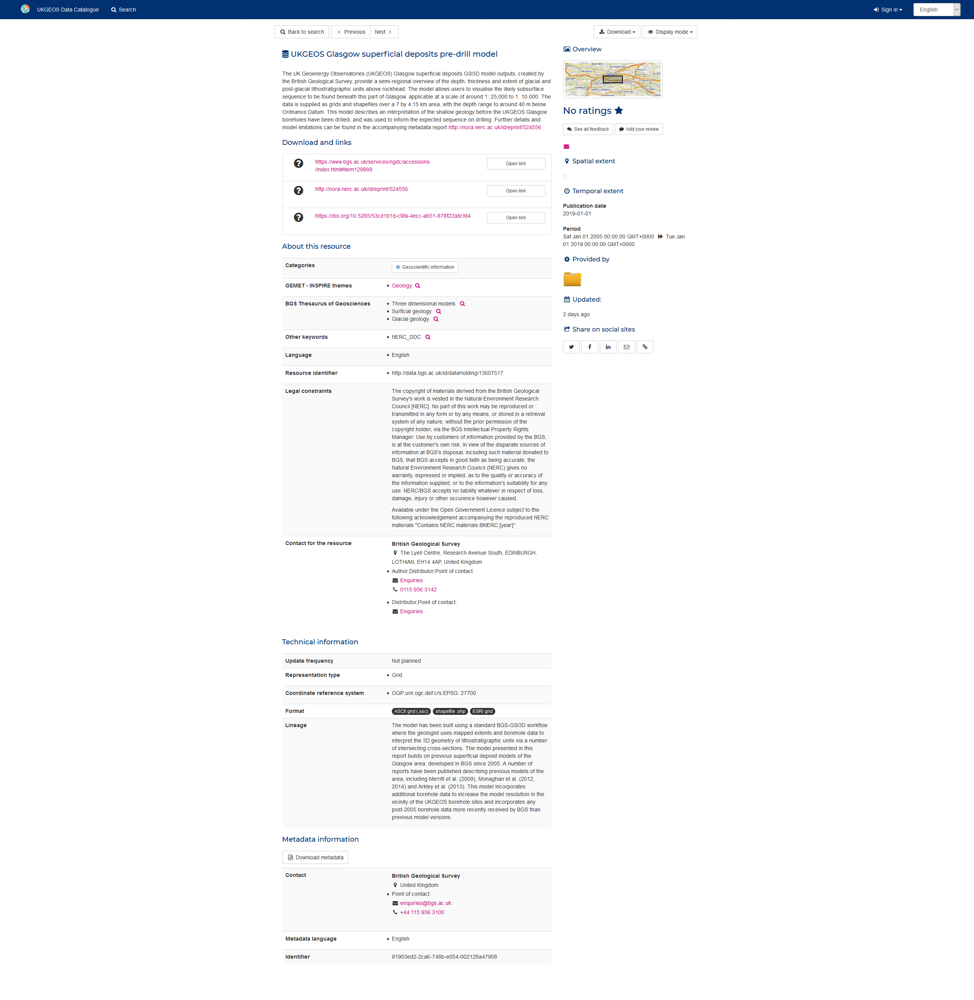
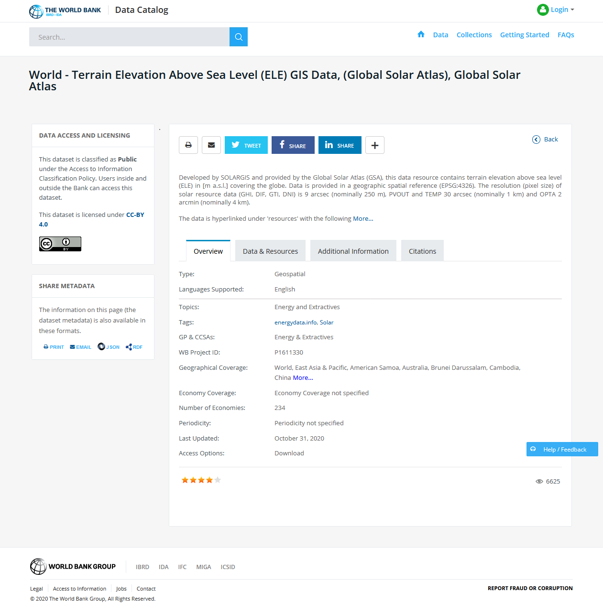
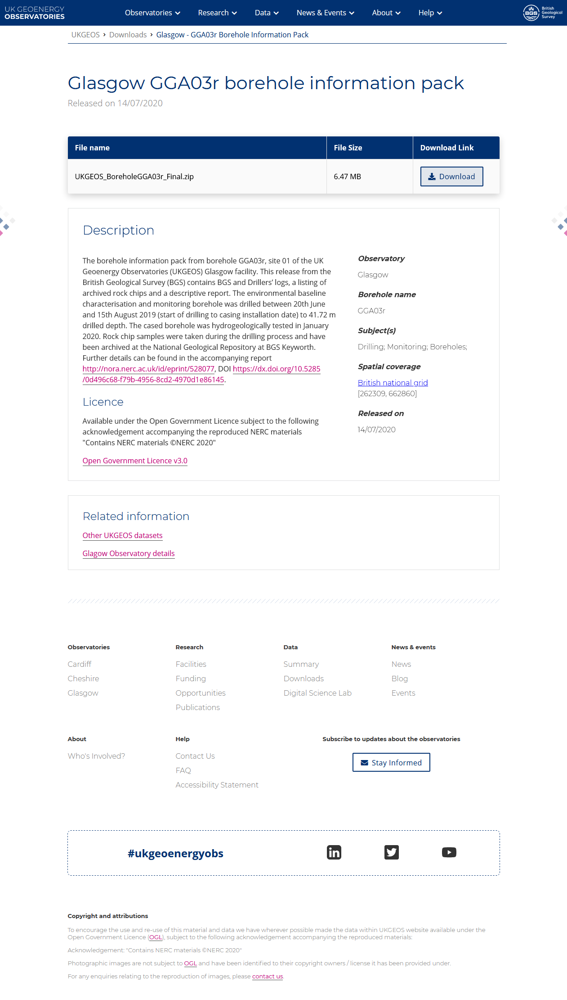

#### Guidance
# Help users to: Explore data records

> After selecting a specific record, the user will explore the data through its meta information to determine if the data can answer their specific question.

## Pain points

These are some of the common painpoints users might experience at this stage:

* Poor or invalid descriptions
* Overwhelming amount of data returned
* Same data from multiple sources
* Ranking by best match did not match user expectations
* Frequency of search term in a record is a bad descriptor
* Misinformation within data set
* Off the shelf search algorithms are inadequate
* Acronyms are difficult to understand and interpret

## Design patterns

### Overview

<!-- tabs:start -->

#### **Main**

#### **Additional Information**

#### **Citations**

#### **Data preview**

#### **Related datasets**

<!-- tabs:end -->

### Component by component 

Below is a checklist of components that are essential for helping users explore a specific dataset.

These components can be arranged in many ways, but the ones with highest importance should be the most visible.

To minimize information overload, the highest importance components can be grouped in a different tab.

?> 1 - highest importance, 2 - medium importance, 3 - lowest importance

<!-- Table of component start -->

| Component             | Description                                                                                                     | Importance |
|-----------------------|-----------------------------------------------------------------------------------------------------------------|:----------:|
| Title                 | Descriptive but not too long                                                                                    |     1      |
| Description / Summary | A brief summary of the dataset outlining what is included in the dataset and for what purpose it was created.   |     1      |
| License               | Brief description of the license the dataset is shared under A link to more details about the specific licence. |     1      |
| Published By          | Author of the dataset.Link to authors page                                                                      |     1      |
| Last Updated          | When was the dataset updated last                                                                               |     1      |
| Created On            | When was the dataset originally published                                                                       |     2      |
| Topic / Subjects      | Keywords that describe the dataset                                                                              |     1      |
| Download Link         | If available, link to dataset file(s)                                                                           |     1      |
| Contact Details       | Contact details of data provider                                                                                |     2      |
| Location              | If known, spatial coverage of the dataset.Visual representation of the coordinatesCoordinate system used        |     1      |
| Preview               | Preview of the data in the browser Map previewTable previewGraph preview                                        |     2      |
| Related datasets      | Datasets related by locationDatasets related by topic                                                           |     2      |
| Human readable URL    | Easy to read URL for the dataset                                                                                |     2      |
| Link to homepage      | Easy way to get back to homepage                                                                                |     3      |
| Search field          | Search field that allows simple text search from within dataset page                                            |     3      |
| Sharing icons         | Icons for sharing dataset through email and various social networks                                             |     3      |

<!-- Table of components end -->

### When to use this pattern

This dataset details page provides users with information that they couldn't find on the search results pages. At this point of the user journey they might want to examine the dataset to ensure that it has the appropriate license and meet their other requirements. 

They might also also like, if possible, to visualise data in an appropriate format for its type and possibly preview a smaller sample of the whole dataset to avoid downloading large files or purchasing the wrong datasets.

### Examples from other data portals

Geonetwork    |  The World Bank         |  data.gov.uk   |  ukgeos.ac.uk  
:------------------:|:------------------------:|  :------------------------:| :------------------------:| 
    |   |   |  

## Related research for this pattern

