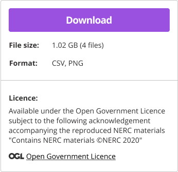
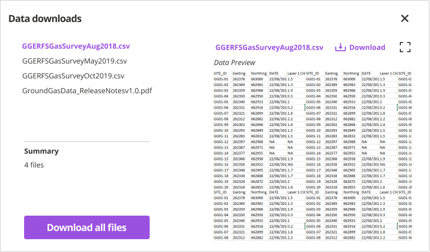
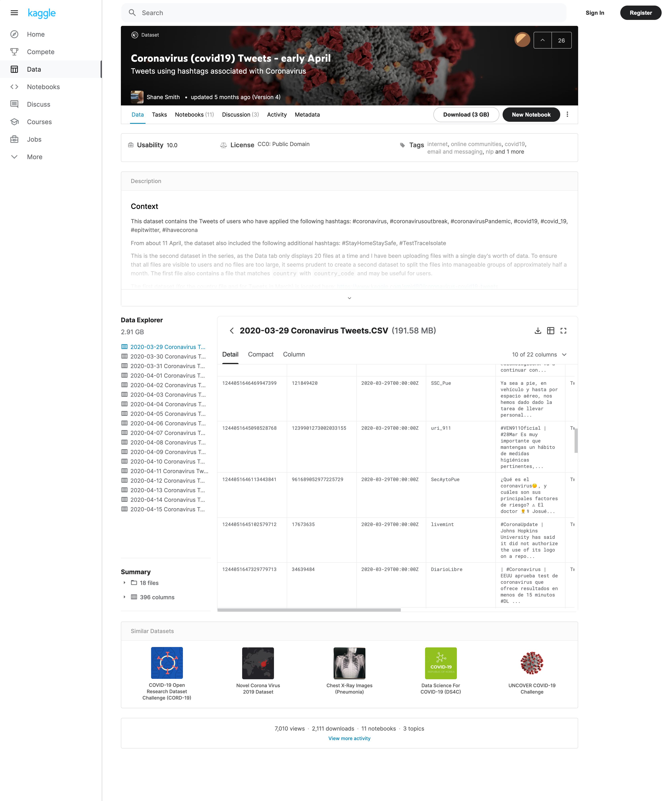

#### Guidance
# Help users to: Use selected data

> At this stage users already identified the dataset(s) that interest them and they would like to start exploring it or interacting with it.
> Data is either downloaded for further analysis or inspected within the portal itself
> The process for accessing and downloading data should be quick and simple. Users should ideally be able to see the list of files to be downloaded and pick and choose which ones to download.

## Pain points

These are some of the common painpoints users might experience at this stage:

* Mixed and variable formats
* Not mobile friendly
* Too many steps restricting access
* Different standards
* No API access
* Licensing restrictions
* Reliance on others for interpretation
* Character corruption

## Design patterns

### Overview

<!-- tabs:start -->

#### **Download panel**

#### **Download options**

<!-- tabs:end -->

### Component by component 

Below is a checklist of components that are essential for helping users easily download the right data.

These components can be arranged in many ways, but the ones with highest importance should be the most visible.

?> 1 - highest importance, 2 - medium importance, 3 - lowest importance

|Component                                      |Description                                                                                                                     |Importance|
|-----------------------------------------------|--------------------------------------------------------------------------------------------------------------------------------|:--------:|
|Data types pills/chips/tags                    |Most used / common data types are highlighted in search results.                                                                |1         |
|Good quality data marker                       |Good quality data is highlighted in search results.                                                                             |1         |
|Licensing information clarifier                |Licensing information badgesHuman-readable summary of licensing terms (dos and don'ts)                                          |1         |
|Sample data availability marker                |Search results with sample data are highlighted.                                                                                |2         |
|Links to publish and manage data/ documentation|Accessing details and documentation about publishing, managing and using data.                                                  |1         |
|Data explorer                                  |Preview of data files, structure, size, etc.                                                                                    |2         |
|Links to usage examples                        |Examples of what the data can be used for, could also provide a sandbox environment for users to test and interact with the data|2         |
|Mobile friendly search                         |Search, filtering, sorting, etc. in a mobile view layout.                                                                       |3         |
|Mobile friendly results list                   |Search results  in a mobile view layout.                                                                                        |3         |
|Mobile friendly data overview                  |Dataset detailed overview  in a mobile view layout..                                                                            |3         |

### When to use this pattern

Datasets are usually downloaded from dataset details page. Users should know what exactly they are downloading and how large the dataset file is. 

If dataset is not available for download for some reason, it should be made clear. If dataset is supposed to become available for downloading at some point in the future, it should be clear when.

### Examples from other data portals

|Kaggle    |  BGS Accessions         |  
|------------------|------------------------|  
|    |   |  

## Related research for this pattern

