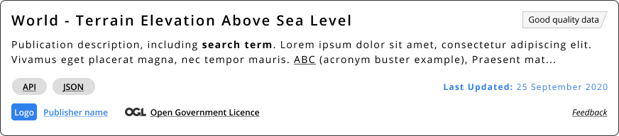
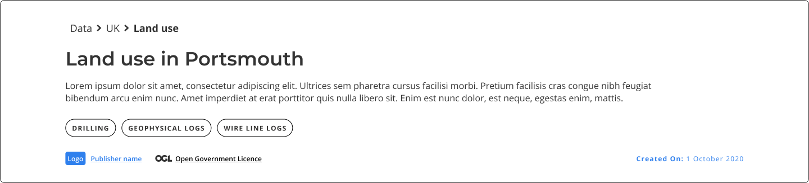

### Help users to
# Assess data quality 

> Data quality may not always be in the hands of data portal's maintainers. To ensure that users can make and informed decision about the dataset, they should know who produced the dataset and when it was updated last.

 If the dataset gets regular updates, it might also be important to know how frequent those updates are.

!> Find more details in the [The Government Data Quality Framework](https://www.gov.uk/government/publications/the-government-data-quality-framework/the-government-data-quality-framework)

## What it looks like

Knowing the organization that created the dataset and when it was updated last is important both on the Search Results and Dataset Details page.

User trusts datasets more from the organizations they are familiar with. And knowing that the dataset has been updated recently can give them the confidence the dataset is being maintained.

*Search results card. Making this information accessible on the search results page can help users filter datasets more effectively*

*Dataset details heading. Dataset details page should make this information available at a glance as well*

## Why/when to use this 'pattern'

Knowing the properties of the dataset that convey its quality are important both at the searching stage and exploring a specific dataset.

<a href="#/main-content/introduction?id=_2-search-within-data-portal" >View common painpoints/frustrations</a>

## Related

* [Make sense of search results](/main-content/steps/make-sense-of-search-results)
* [Explore data online](/main-content/steps/explore-data-online)

---

<!-- Additional information can be presented in dropdown menus -->

Essential components

 

Below is a checklist of components/information that are relevant for this task.

These components can be arranged in many ways, but the ones with highest relevance should be the most visible/accessible.

?> 1 - high relevance, 2 - medium relevance, 3 - low relevance

<!-- Table of component start -->

| Component             | Description                                                                                                     |  Relevance |
|-----------------------|-----------------------------------------------------------------------------------------------------------------|:----------:|
| Dataset author                 | Who produced the datasat? Do they have contact details?                                                                                   |     1      |
| Last updated | When was the dataset updated last   |     1      |
| Update frequency               | How often does it get updated |     2      |

