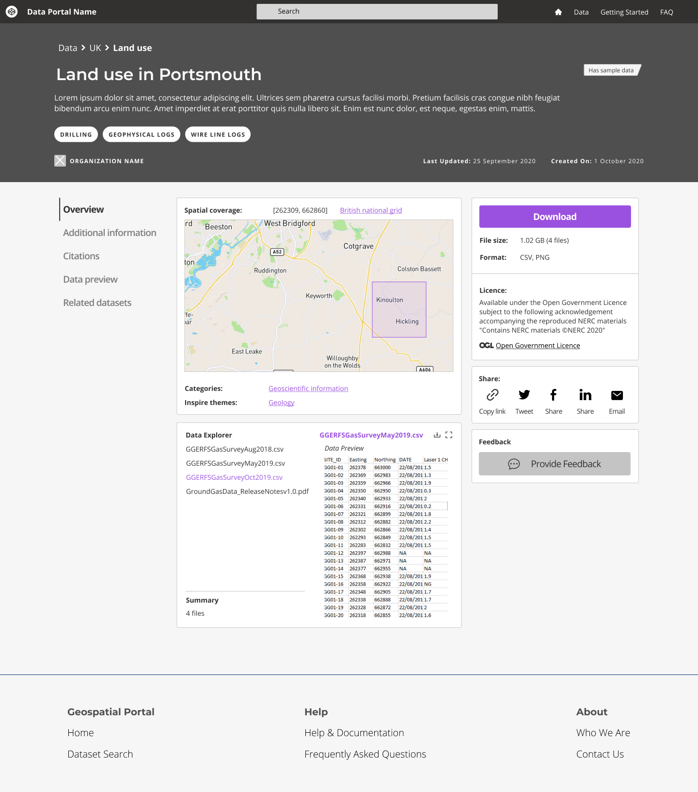
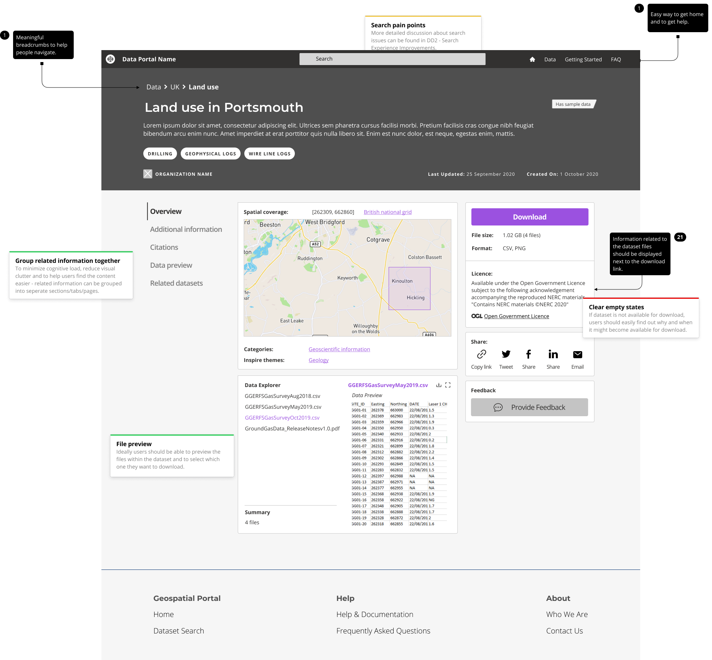
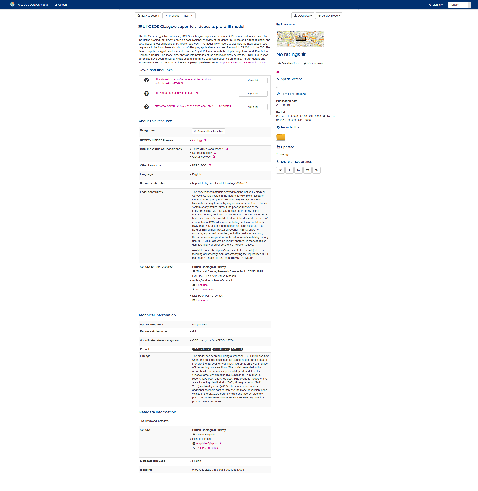
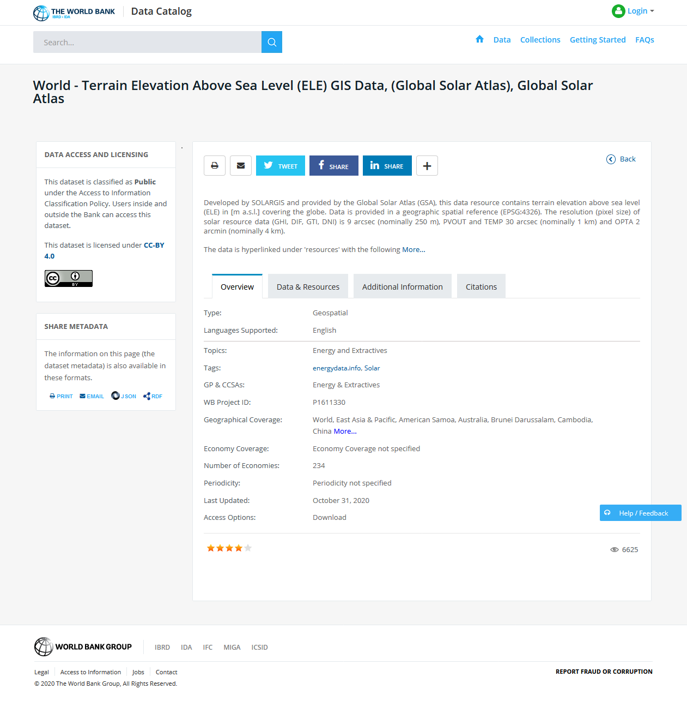
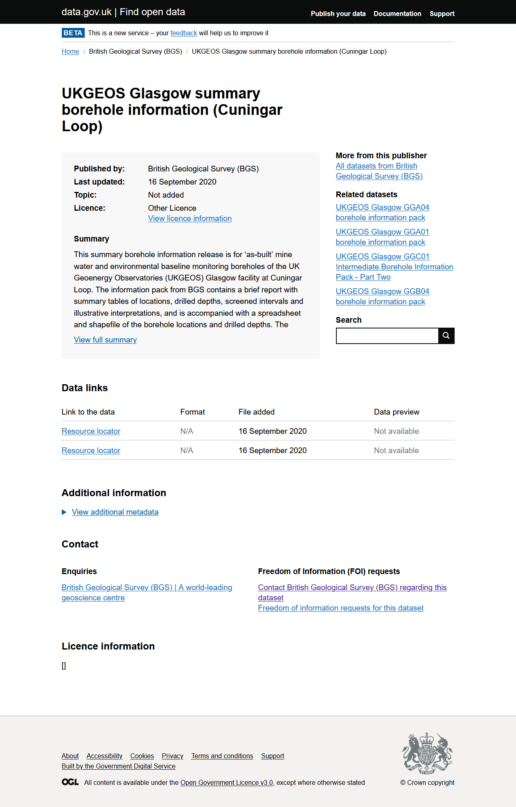
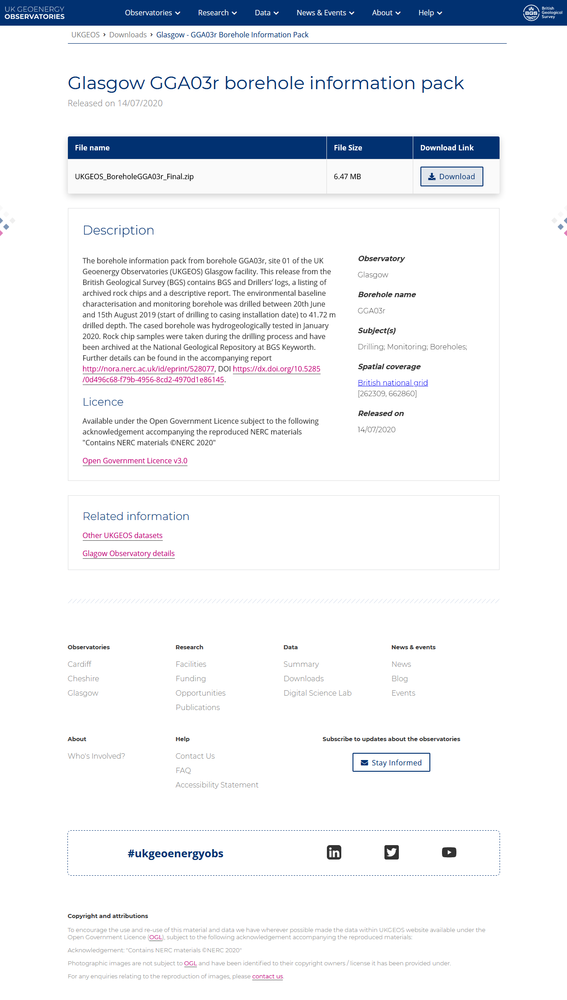

### Help users to
# Assess dataset relevance

> For a more detailed overview of the dataset users might explore it on the dataset details page. It should provide all the essential information required to make a decision whether this specific dataset will be useful to them.

The so called dataset details page usually is the first place that users might arrive from a search engine. Thus, it should be instantly clear whether this dataset is available for download or not, what license it is shared under and anything else that might effect how they use of how they are allowed to use the data.

## What it looks like

<!-- tabs:start -->

#### **Wireframe**

#### **Example**

#### **Example with comments**

<!-- tabs:end -->

Primary information should be the most the most visible. It includes:
* dataset title
* short description
* topics
* publisher name
* created on date
* lasted updated date

If the data is available for download, the download link should be easy to find and access on the page. Ideally it should always stay on the page as the users are exploring the dataset details page. If the dataset is not available for download, it should be indicated why and when it would become available.

User should also be made aware of the licence details, so they can make an informed decision about using this dataset.

Any additional metadata can have less visibility. To reduce the visual clutter on the screen it can be displayed in different tabs or dropdown menus.

## Related

* [Explore data online](main-content/steps/explore-data-online)

## Why/when to use this 'pattern'

Dataset details page is used to present all available information related to a single specific dataset. 

<a href="#/main-content/introduction?id=_4-explore-data-records">View common painpoints/frustrations</a>

---

<!-- Additional information can be presented in dropdown menus -->

Essential components

 
Below is a checklist of components/information that are relevant for this task.

These components can be arranged in many ways, but the ones with highest relevance should be the most visible/accessible.

?> 1 - high relevance, 2 - medium relevance, 3 - low relevance

<!-- Table of component start -->

| Component             | Description                                                                                                   | Relevance |
|-----------------------|---------------------------------------------------------------------------------------------------------------|:---------:|
| Title                 | Descriptive but not too long                                                                                  |     1     |
| Description / Summary | A brief summary of the dataset outlining what is included in the dataset and for what purpose it was created. |     1     |
| Topics                | Dataset topics which allow users to easily jump to them                                                       |     1     |
| Organization name     | Organization that produced the dataset                                                                        |     1     |
| Last updated          | When was the dataset updated last. Possibly a changelog if available                                          |     1     |
| Created on            | When was the dataset created                                                                                  |     1     |
| Data explorer         | An ability to preview the files included in the dataset and to select which ones to download                  |     3     |
| Data preview          | An ability to preview the dataset in map, table or graph                                                      |     3     |
| Related dataset       | Datasets related by topic, proximity or any other suitable property                                           |     2     |
| Citation details      | Details on how the dataset should be cited                                                                    |     2     |
| Home link             | Easy way to get back to data portal's homepage                                                                |     2     |
| Search bar            | An easy way to search for other dataset within the same portal                                                |     3     |

Examples from other portals

 

*Geonetwork dataset details page*

*The World Bank dataset details page*

*data.gov.uk dataset details page*

*UKGEOS dataset details page*

