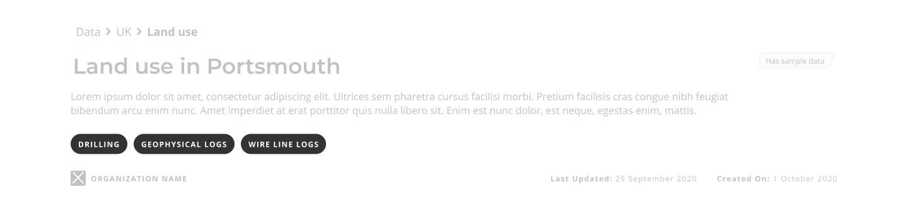
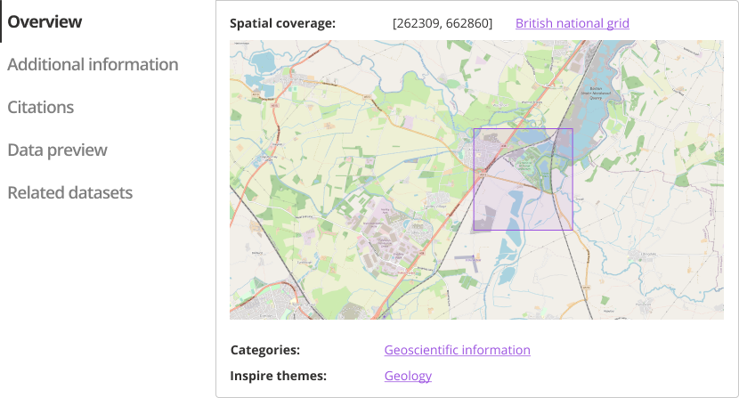
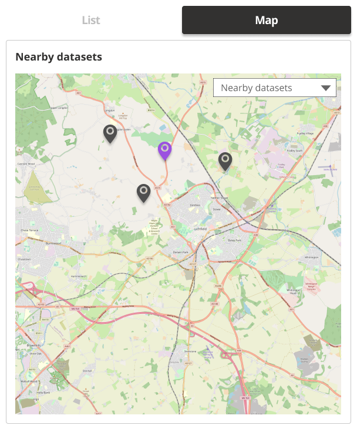

### Help users to
# Assess dataset relevance

> Ensure datasets are represented accurately with essential metadata. Users often base their decision on whether to use a dataset by how clearly this information is presented to them.

Users may often first arrive at a [dataset details page](../../main-content/pages/dataset-details) after performing a search from a search engine. Thus, it should be instantly clear whether a dataset is available for download or not, what license it is shared under and anything else that may effect how this dataset is used. Ensure users are also provided with a route to understand the data portal in which this dataset record is described, this can be achieved through well design [navigation](/main-content/steps/navigate-the-portal). 

## What it looks like

### 1. Clear dataset title

The first thing that users see will be the dataset title. It should be the main heading on the dataset details page.

*Heading section for dataset details*

### 2. Short description

A short description summarising the main properties of the dataset should provide users with a quick understanding of the relevance of this data.

### 3. Topics

Topics that this dataset covers. Ideally, they should be linked to the topic pages where users could explore other datasets of the same topic.

*Dataset topics*

### 4. Publisher name

Publisher name and if possible a logo for easier recognition help users to understand the origin and trustworthyness of data.

### 5. Licence details

Licence details and any relevant links to terms of use help users to assess whether this data is compatible with there needs.

### 6. Created on date and period it relates to

Date when the dataset was created and the period of time it relates to allow users to ifdentify if this data is relevant to their enquiry.

### 7. Update frequency and last uodated date

The date when the dataset was last updated and the frequency of updates provide users with a means to assess how current this data is.

### 8. Download link

If the data is available for download, the download link should be easy to find and access on the dataset details page. Ideally it should always stay visible on the screen as the users are exploring the dataset details page. If the dataset is not available for download, it should be indicated why or when it would become available.

If there are multiple ways to access data (e.g. API access), instructions should be provided on how to do that.

*Download link*

### 9. Location preview

Clearly show the geographical extent of the data (pin on the map or polygon of area covered). If coordinates are included, provide information about the coordinate reference system used. If the terrain elevation is known it should be displayed together with the geographical extent.

*Location preview*

### 10. Additional metadata

Additional metadata can have less visibility in order to reduce the visual clutter on the screen by being displayed in a less prominant location such as different tabs or dropdown menus.

*Dataset topics*

### 11. Related datasets

Related datasets can help users to discover and explore similar datasets. They can be displayed in a list or map view. 

A few possible ways to group and identify related datasets include:

* Nearby datasets
* By topics and keywords
* By provider or publisher

List view             |  Map view
:-------------------------:|:-------------------------:
 | 

*Related datasets in list and map view*

## When to use

To present information about a single dataset record.

## Example page

> **[Dataset details](/main-content/pages/dataset-details)**

<!-- ## Related

* [Help users to explore data online](main-content/steps/explore-data-online)
* [Best practice guidance and tools for geospatial data managers](https://www.gov.uk/government/collections/best-practice-guidance-and-tools-for-geospatial-data-managers) -->

