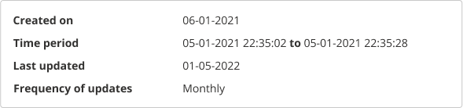
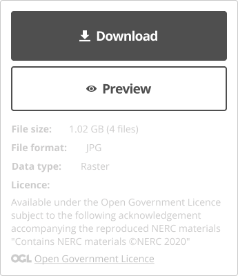
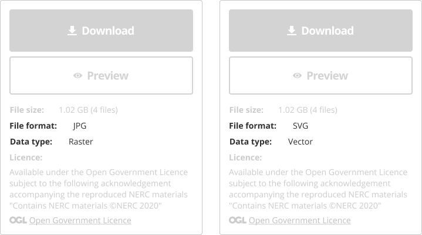

Help users to...

<h1 id="assess-dataset-relevance" style="margin-top: 0px">Assess dataset relevance</h1>

> Ensure datasets are represented accurately with essential metadata. Users often base their decision on whether to use a dataset by how clearly this information is presented to them.

Users may often first arrive at a [dataset details page](../../main-content/pages/dataset-details) after performing a search from a search engine. Thus, it should be instantly clear whether a dataset is available for download or not, what license it is shared under and anything else that may effect how this dataset is used. Ensure users are also provided with a route to understand the data portal in which this dataset record is described, this can be achieved through well designed [navigation](/main-content/steps/navigate-the-portal). 

## What it looks like

!> A user's perception of dataset quality is driven by a number of different factors, such as publisher, publication date, frequency of updates, well-described metadata, how complete the data is and a clear visual presentation within the portal itself. 
 
For more information read how to help users to... [assess data quality](main-content/steps/assess-data-quality).

### 1. Clear dataset title

Dataset titles should be clearly visible as the first heading users are presented with.

*Heading section for dataset details*

### 2. Short description

A short summary describing the main properties of a dataset will provide users with a quick understanding of how relevant a dataset is.

### 3. Topics

Grouping datasets under parent topics can help users understand the relevancy of a dataset and act as navigation for potentially related datasets.

*Dataset topics*

### 4. Publisher name

Publisher details such as publisher name, and an image of their logo could help users recognise the quality of a dataset and promote trust with reputable dataset sources.

### 5. Licence details

Help users asses whether data is compatable with their needs by providing licence details and any relevant links to terms of use.

### 6. Created on date and period it relates to

Provide users with information about when a dataset was created and the period of time the data relates to.

### 7. Update frequency and last updated date

Indicate how current datasets are, providing users with information about when a dataset was last updated and the frequency of updates.

*Dataset details relating to creation time and updates*

### 8. Download link

If the data is available for download, the download link should be easy to find and access on the dataset details page. Ideally it should always stay visible on the screen as the users are exploring the dataset details page. If the dataset is not available for download, it should be indicated why or when it would become available.

If there are multiple ways to access data (e.g. API access), instructions should be provided on how to do that.

*Download link*

### 9. Location preview

Clearly show the geographical extent of the data (pin on the map or polygon of area covered). If coordinates are included, provide information about the coordinate reference system used. If the terrain elevation is known it should be displayed together with the geographical extent.

*Location preview. Map source: [OpenStreetMap](https://www.openstreetmap.org)*

### 10. File format

Two primary formats for spatial data are [vector and raster](https://en.wikipedia.org/wiki/GIS_file_formats). It was discovered in our research that users would like to know the data format before downloading any file(s). Making this information easily findable will help them make an informed decision on whether this data will be useful for their specific task or problem.

*Data format information next to download link*

### 11. Additional metadata

Additional metadata can have less visibility in order to reduce the visual clutter on the screen by being displayed in a less prominant location such as different tabs or dropdown menus.

*Extra metadata items in human-readable format*

### 12. Related datasets

Related datasets can help users to discover and explore similar datasets. They can be displayed in a list or map view. 

A few possible ways to group and identify related datasets include:

* Nearby datasets
* By topics and keywords
* By provider or publisher

List view             |  Map view
:-------------------------:|:-------------------------:
 | 

*Related datasets in list and map view. Map source: [OpenStreetMap](https://www.openstreetmap.org)*

<!-- ## Related

* [Help users to explore data online](main-content/steps/explore-data-online)
* [Best practice guidance and tools for geospatial data managers](https://www.gov.uk/government/collections/best-practice-guidance-and-tools-for-geospatial-data-managers) -->

