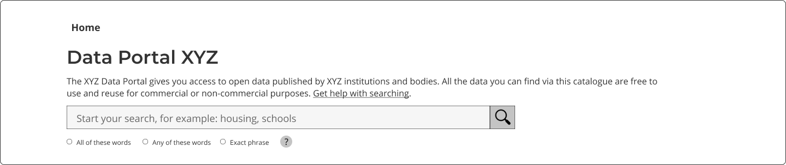

### Help users to
# Check if portal is relevant

> Clearly communicate what subject matters, geographical areas and data licensing users can expect to find within the portal. Doing this helps users save time as it tells them upfront whether a new portal is going to help them find the data they need.

Users might not always arrive via a data portal homepage, so this essential information should always be just a few clicks away.

## What it looks like

The homepage should clearly answer these key questions:

## 1. Purpose of data portal

What is the purpose of this data portal, what are the topics it covers?

*Heading for the homepage*

## 2. Organization managing this portal

Users should be able to easily find more details about the organization managing the data portal either from the About Us page or the organization logo in the navbar.

*Navigation bar with organization's logo and link to About Us page*

## 3. Licencing

Ideally users should be able to find the licencing details on the homepage ([see #1](/main-content/steps/check-a-portal-is-relevant#1-what-is-the-purpose-of-this-data-portal-what-are-the-topics-it-covers))

If datasets have different licences,the information should be provided on each dataset's details page.

## 4. Where to start?

Where do users start searching/exploring the data? If the data portal does not not allow users to search for data directly from the homepage, they should easily find instructions where to start.

## When to use

These concepts are useful when introducing new users to the data portal. It can also be handy for returning users who want to explore datasets by topic or check the licencing information for dataset(s) they used.

## Example page

> **[Homepage](/main-content/pages/homepage)**

---

<!-- Additional information can be presented in dropdown menus -->

Essential components

 
Below is a checklist of components/information that are relevant for this task.

These components can be arranged in many ways, but the ones with highest relevance should be the most visible/accessible.

?> 1 - high relevance, 2 - medium relevance, 3 - low relevance

<!-- Table of component start -->

| Component                  | Description                                                            | Relevance |
|----------------------------|------------------------------------------------------------------------|:---------:|
| Purpose of the data portal | Why was this portal created?                                           |     1     |
| Topics covered             | What topics does this data portal cover?                               |     1     |
| Organisation details       | Who is managing the data portal?                                       |     1     |
| Licence details            | Is all the data shared under the same licence? If not - what are they? |     2     |
| Geographical areas covered | Does this portal cover a specific geographical area?                   |     2     |

