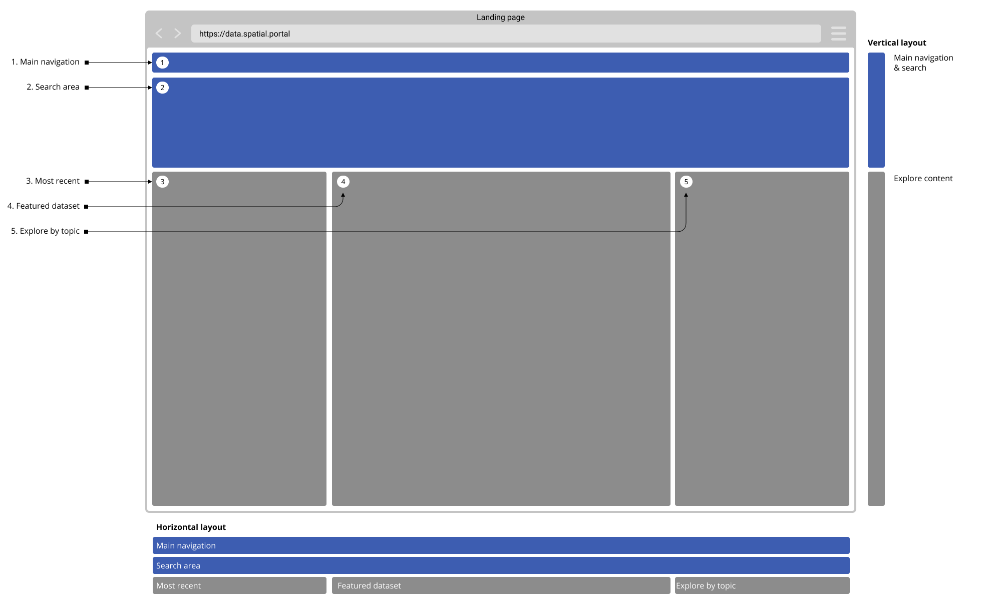
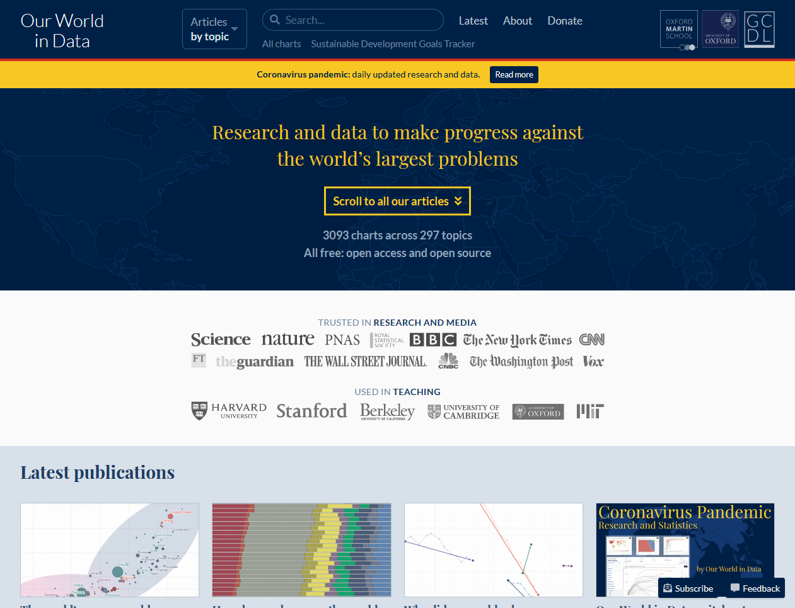
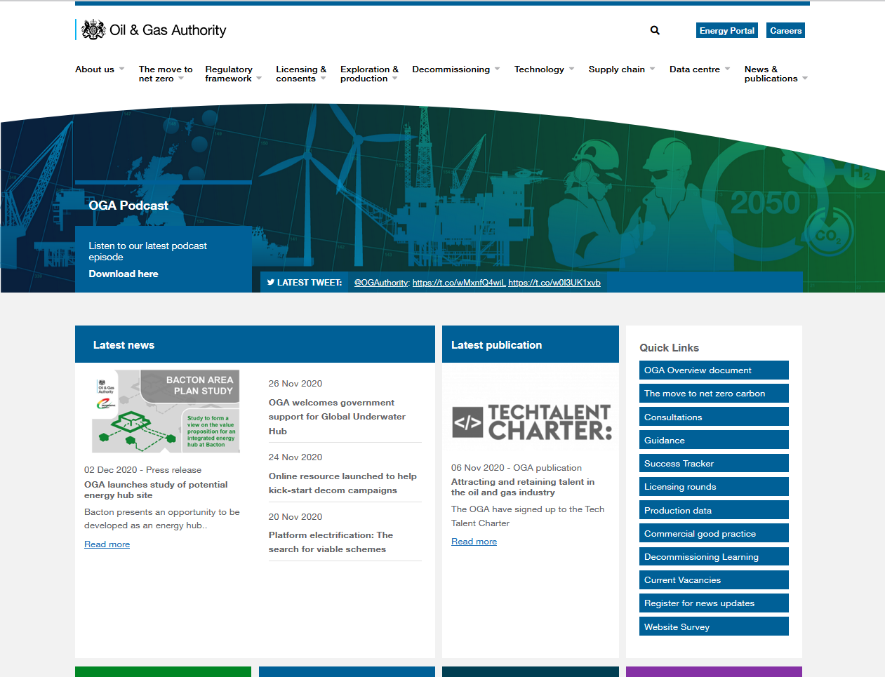

### Help users to
# Check if portal is relevant

> Clearly communicate what subject matters, geographical areas and data licensing users can expect to find within the portal. Doing this helps users save time as it tells them upfront whether a new portal is going to help them find the data they need.

Users might not always arrive to data portals homepage, so this essential information should always be a few clicks away.

## What it looks like

The homepage should clearly answer these key questions:
* What is the purpose of this data portal, what are the topics it covers?
* Who is the organization managing this portal?
* What licence is the data shared under?
* Where do users start searching/exploring the data?

If users arrive at other pages, and not the homepage, they should be able to easily access the Home or the About Us pages.

<!-- tabs:start -->

#### **Wireframe**

<!--  -->

#### **Example**

<!--  -->

#### **Example with comments**

<!--  -->

<!-- tabs:end -->

## Why/when to use this 'pattern'

This pattern/page is useful when introducing new users to the data portal. It can also be handy for returning users who want to explore datasets by topic or check the licencing information for dataset(s) they used.

<a href="#/main-content/introduction?id=_1-discover-data-sources" >View common painpoints/frustrations</a>

---

<!-- Additional information can be presented in dropdown menus -->

Essential components

 
[Brief description and a list of the most relevant components/information for this task]

Below is a checklist of components/information that are relevant for this task.

These components can be arranged in many ways, but the ones with highest relevance should be the most visible/accessible.

?> 1 - high relevance, 2 - medium relevance, 3 - low relevance

<!-- Table of component start -->

| Component                  | Description                                                            | Relevance |
|----------------------------|------------------------------------------------------------------------|:---------:|
| Purpose of the data portal | Why was this portal created?                                           |     1     |
| Topics covered             | What topics does this data portal cover?                               |     1     |
| Organization details       | Who is managing the data portal?                                       |     1     |
| Licence details            | Is all the data shared under the same licence? If not - what are they? |     2     |
| Geographical areas covered | Does this portal cover a specific geographical area?                   |     2     |

Examples from other portals

 

<!-- Images start -->

[A few examples from other portals can go here]

*Our world in data*

*Oil and Gas authority*

<!-- Images end -->

