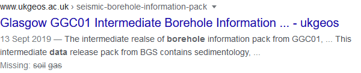

### Help users to
# Discover your portal

> Most people looking for spatial data begin their journey in search engines. The first contact with a new data portal will likely be through the search engine results.

How the data portal will be presented in the search results depends on the search engine optimisation used by the portal developers. A more detailed report and recommendations can be found in the report below.

!> Find more details in the [Search engine optimisation for publishers: Best practice guide](https://www.gov.uk/government/publications/search-engine-optimisation-for-publishers-best-practice-guide)

## What it looks like

The dataset or the dataportal will be presented with a heading and a short description in the search results. Depending on what the user searched for, they will end up the data portal's homepage or the specific dataset's details page.

*Google search results*

*Bing search results*

## Why/when to use this 'pattern'

To ensure that the data portals the datasets it hosts are presented well in search engines it is important to ensure they have the correct and machine readable meta-data. 

<a href="#/main-content/introduction?id=_1-discover-data-sources" >View common painpoints/frustrations</a>

---

Essential components

 
Below is a checklist of components/information that are relevant for this task.

These components can be arranged in many ways, but the ones with highest relevance should be the most visible/accessible.

?> 1 - high relevance, 2 - medium relevance, 3 - low relevance

<!-- Table of component start -->

| Component             | Description                                                                                                     |  Relevance |
|-----------------------|-----------------------------------------------------------------------------------------------------------------|:----------:|
| Title                 | This will be the first thing that users see in search results, so it has to clear and descriptive. Title could also include the organisation who generated the dataset.                                                                                  |     1      |
| Description / Summary | Short description should be no longer than a few paragraphs, since users are likely to see only the first one or two sentences of this summary in the search results.   |     1      |

Examples from other portals

 

*Search results for 'ukgeos glasgow data borehole soil gas'*

