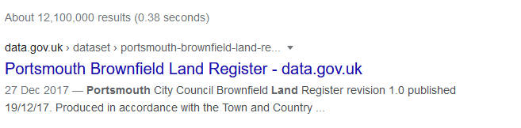
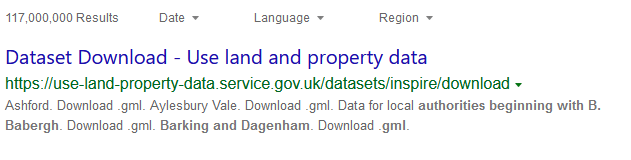
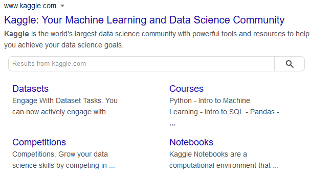

### Help users to
# Discover your portal

> Maximise the discoverability of data portals through search engine optimisation. This matters because most people looking for spatial data begin their journey in search engines. The first contact with a new data portal will likely be through the search engine results.

How the data portal will be presented in the search results depends on the search engine optimisation used by the portal developers. 

To ensure that data portals and the datasets they contain are presented well in search engines it is important to ensure they have the correct and machine readable meta-data. 
A more detailed report and recommendations can be found in the report below.

!> Find more details in the [Search engine optimisation for publishers: Best practice guide](https://www.gov.uk/government/publications/search-engine-optimisation-for-publishers-best-practice-guide)
## What it looks like

Using the search engine, the users are most likely to discover either one of the datasets hosted by the data portal or the homepage of the portal itself. It is important that the datasets have easy to read and understandable titles and descriptions and the portal has a memorable url and brief description of its purpose.

## 1. Dataset title

The heading should briefly describe the dataset. If any extra text is used - organisation name, date, etc. - it should be placed at the end of dataset name, e.g. **dataset-title | organisation name | date-produced**.

## 2. Dataset description

Only the first few lines of the description will be visible in the search results, so the first few sentences should have the most relevant information.

*Google search results*

*Bing search results*

## 3. Portal URL

The URL should be short, relevant and memorable.

## 4. Portal name

Ideally the data portal URL and name should be the same. If it's not possible, it should still be human readable and memorable.

## 5. Portal description

The data portal should have a brief description telling its purpose and describing the type of data it serves.

*Kaggle portal in search results*

