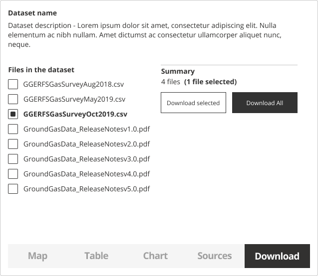
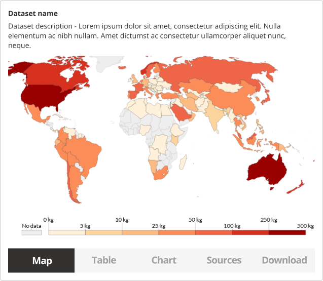
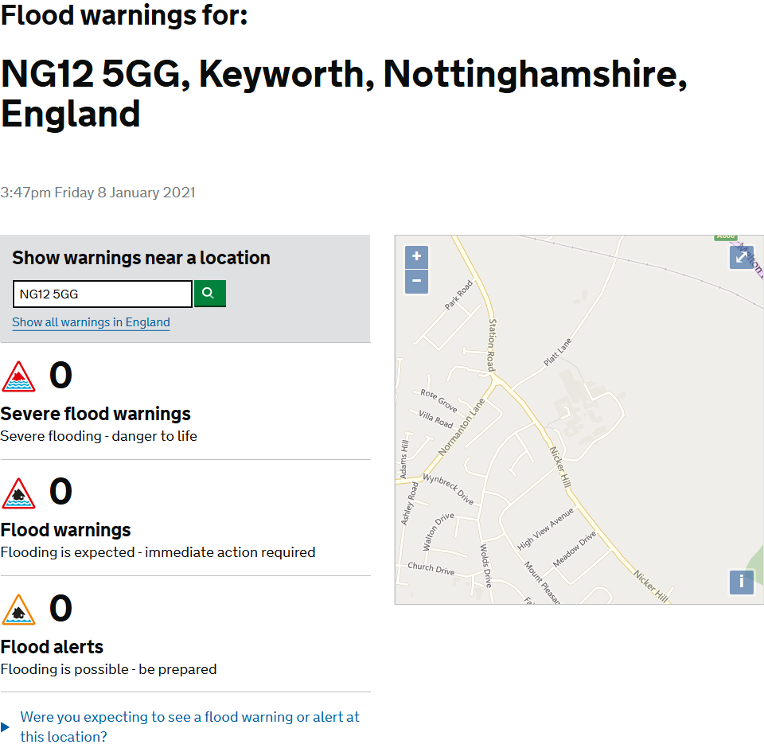

### Help users to
# Explore data online

> Allow users to visualise or preview data prior to requesting a dataset for download. Some users may only require an online preview of the data, for example, when wanting a single value from a certain location, e.g. the flood risk in a specific location. Giving access to this information ensures the user can save time if they do not require a download.

The usefulness of data visualisation online depends on the data being provided, the type of users accessing the data and their needs.

By providing a dataset preview, users are able to quickly assess the relevance and [data quality](/main-content/steps/assess-data-quality), prior to download and use. Options to download a sample or a selection of the dataset are also helpful to users who are on limited internet bandwidths.

Dataset previews and visualisations should be presented on the [dataset details](/main-content/steps/search-for-data) page.

## What it looks like

There are multiple ways that the data can be explored online - maps, tables, charts. For geospatial data, a map based interface would be the most appropriate method. 

Any dataset that can not be previewed online should include a written description or example visualisation of the data to help users get a better understanding of what is included. This also ensures your data portal follows our [accessibility](/main-content/accessibility) guidance for users with visual impairments. 

When previewing data online, users might have one of these goals:
* Preview the data online to get a better understanding of its contents
* Find a specific value for a location
  
### 1. Preview the contents of the dataset

Allowing for users to preview the contents of a dataset, including any files, will help them to make better decisions on whether to use a dataset.

*Dataset preview in a table. Dataset source: [kaggle.com](https://www.kaggle.com/utkarshxy/who-worldhealth-statistics-2020-complete))*

### 2. Visualise the data

If technology and resources allow, a more detailed data preview can enable users to analyse and evaluate a dataset within the data portal.

*Dataset preview on a map. Map source: https://ourworldindata.org/*

### 3. Get specific information online

Understanding the user's needs when it comes to data will ensure when to display data directly in the data portal or when to provide quick access to a download.

An example below shows the [flood warning data ](https://flood-warning-information.service.gov.uk/). Users can get the information they need directly in the browser without downloading the dataset.

*Flood risk information online. Source: https://flood-warning-information.service.gov.uk/*

<!--

Essential components

 
[Brief description and a list of the most relevant components/information for this task]

Below is a checklist of components/information that are relevant for this task.

These components can be arranged in many ways, but the ones with highest relevance should be the most visible/accessible.

?> 1 - high relevance, 2 - medium relevance, 3 - low relevance

| Component         | Description                                                            | Relevance |
|-------------------|------------------------------------------------------------------------|:---------:|
| Location          | Coordinates or the postcode of the location                            |     2     |
| Value of interest | Value of interest for that specific location                           |     2     |
| Table preview     | Online preview of CSV data                                             |     3     |
| Graph preview     | Bar charts visualizing the data                                        |     3     |
| Map preview       | Map with markers showing the values at specific locations or a heatmap |     3     |

 -->

