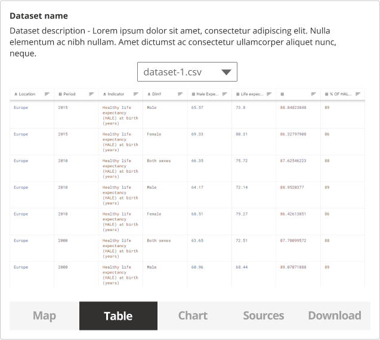

### Help users to
# Explore data online

> Many users emphasize the ability to visualize or preview the data before downloading it. For some it might be all they require - to get a specific value from a certain location, e.g. the flood risk in a specific location. If they can get that information from the portal directly, they don't need to download the data itself.

How important the data exploration online, depends on the data being provided and the type of users who are accessing this data. Thus, some user research might be necessary to better understand the need for online data exploration.

## What it looks like

There are multiple ways that the data can be explored online - tables, charts, maps.

Users previewing the data online might have one of these goals:
* Find a specific value for a location of interest
* Preview the data online to get a better understanding of its contents

If users require only a specific value, there is no need to display additional information. After a simple post code or location search they could be presented with a value for that location.

### 1. Preview data

Allowing users to preview the files included in the dataset and their content can help them make a better decision on the usefulness of the dataset.

*Preview the contents of CSV files*

### 2. Visualize data

If technology and resources allow a more detailed data preview can also help users evaluate the dataset and do an exploratory data analysis within the data portal.

*Data could preview in Map, Table and Chart form*

### 3. Get specific information online

There might be cases when users can get the information they need without downloading the dataset. This requires understanding the users needs and data properties.

If it is clear what information the users are looking for, it should be possible to search for it directly and it should be displayed in a format that's directly useful to them.

*Flood risk information on gov.uk*

## When to use this

This pattern can be used to address specific user needs directly within the data portal. Previews give information on data quality and relevancy prior to download and use. Options to download a sample or a selection of the dataset are helpful to users who are on limited internet bandwidths.

### Example Page

> **[Dataset details](/main-content/pages/dataset-details)**

---

<!-- Additional information can be presented in dropdown menus -->

Essential components

 
[Brief description and a list of the most relevant components/information for this task]

Below is a checklist of components/information that are relevant for this task.

These components can be arranged in many ways, but the ones with highest relevance should be the most visible/accessible.

?> 1 - high relevance, 2 - medium relevance, 3 - low relevance

<!-- Table of component start -->

| Component         | Description                                                            | Relevance |
|-------------------|------------------------------------------------------------------------|:---------:|
| Location          | Coordinates or the postcode of the location                            |     2     |
| Value of interest | Value of interest for that specific location                           |     2     |
| Table preview     | Online preview of CSV data                                             |     3     |
| Graph preview     | Bar charts visualizing the data                                        |     3     |
| Map preview       | Map with markers showing the values at specific locations or a heatmap |     3     |

