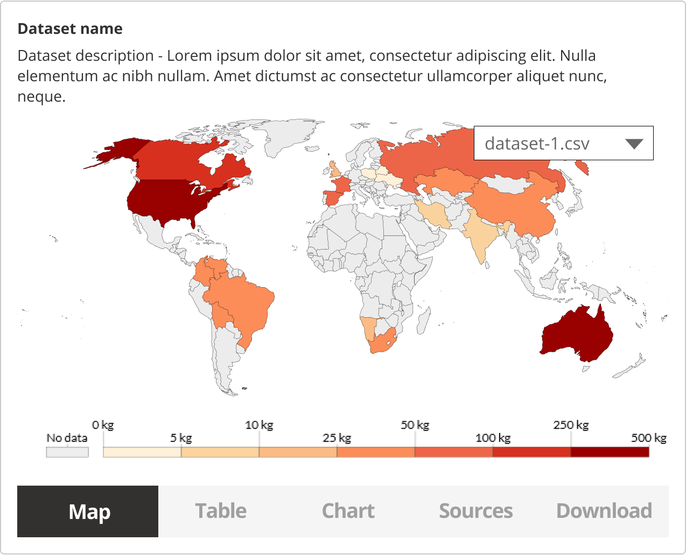

### Help users to
# Explore data online

> Many users emphasise they want the ability to visualise or preview the data before downloading it. For some it might be all they require - to get a single value from a certain location, e.g. the flood risk in a specific location. If they can get that information from the portal directly, they don't need to download the dataset itself.

The usefulness of data visualisation online depends on the data being provided, the type of users accessing the data and their needs.

Dataset previews also give information on [data quality](/main-content/steps/assess-data-quality) and relevancy prior to download and use. Options to download a sample or a selection of the dataset are also helpful to users who are on limited internet bandwidths.

Dataset preview/visualisation would usually happen on the [search page](http://localhost:3000/#/main-content/steps/search-for-data) or the [dataset details](http://localhost:3000/#/main-content/steps/search-for-data) page.

## What it looks like

There are multiple ways that the data can be explored online - maps, tables, charts. For geospatial data, map interface would be the most useful method. 

For datasets that can not be previewed online, a written description of the data can also help users get a better understanding of what is included. It also makes the data portal more [accessible](/main-content/accessibility) to users with visual impairments. 

Users previewing the data online might have one of these goals:
* Preview the data online to get a better understanding of its contents; and
* Find a specific value for a location of interest.
  
### 1. Preview the contents of the dataset

Allowing users to preview the files included in the dataset and their contents can help them make a better decision on the usefulness of the dataset.

*Explore dataset before downloading it (dataset example - [kaggle.com](https://www.kaggle.com/utkarshxy/who-worldhealth-statistics-2020-complete)*

### 2. Visualise the data

If technology and resources allow, a more detailed data preview can help users evaluate the dataset and do an exploratory data analysis within the data portal.

*Previewing data (map - https://ourworldindata.org/)*

### 3. Get specific information online

There might be cases when users can get the information they need directly in the data portal. This requires understanding the users needs and data properties.

An example below shows the [flood warning data ](https://flood-warning-information.service.gov.uk/). Users can get the information they need directly in the browser without downloading the dataset.

*Flood risk information on https://flood-warning-information.service.gov.uk/*

<!--

Essential components

 
[Brief description and a list of the most relevant components/information for this task]

Below is a checklist of components/information that are relevant for this task.

These components can be arranged in many ways, but the ones with highest relevance should be the most visible/accessible.

?> 1 - high relevance, 2 - medium relevance, 3 - low relevance

| Component         | Description                                                            | Relevance |
|-------------------|------------------------------------------------------------------------|:---------:|
| Location          | Coordinates or the postcode of the location                            |     2     |
| Value of interest | Value of interest for that specific location                           |     2     |
| Table preview     | Online preview of CSV data                                             |     3     |
| Graph preview     | Bar charts visualizing the data                                        |     3     |
| Map preview       | Map with markers showing the values at specific locations or a heatmap |     3     |

 -->

