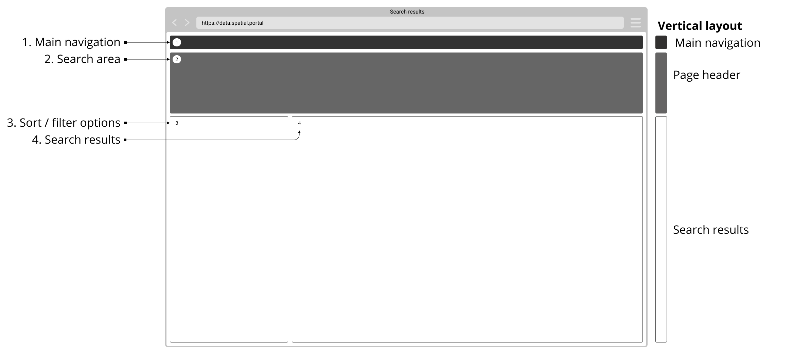

### Help users to
# Make sense of search results

> Clearly present search results matching keyword queries with sufficient sorting and filtering options to further refine and sort results. This is important in helping users identify relevant high quality data quickly in a format they can understand. 

...

...

!> ...

## What it looks like

### 1. Overview / layout for the presentation of results

### 2. Number of results

### 3. Faceted search (by parent / child categories)

### 4. Remove filters

### 5. Sort by

### 6. Apply filters

### 7. Presentation of results

#### a. Ranked ordering by keyword relevance / data quality

#### b. Spatial ordering by area

### 8 Individual record / listing

#### a. Title / description / publisher
#### b. Key meta information
#### c. Licence type
#### d. Feedback for crowdsourcing data quality and relevancy

## Why/when to use this 'pattern'

...

## Related
* [Make sense of search results](main-content/steps/make-sense-of-search-results)
* [Common painpoints/frustrations](main-content/introduction#2-search-within-data-portal)

---
<!-- Additional information can be presented in dropdown menus -->

Essential components

 
Below is a checklist of components/information that are relevant for this task.

These components can be arranged in many ways, but the ones with highest relevance should be the most visible/accessible.

?> 1 - high relevance, 2 - medium relevance, 3 - low relevance

<!-- Table of component start -->

| Component             | Description                                                                                                     |  Relevance |
|-----------------------|-----------------------------------------------------------------------------------------------------------------|:----------:|
| ...                   | ...                                                                                                             |     1      |

