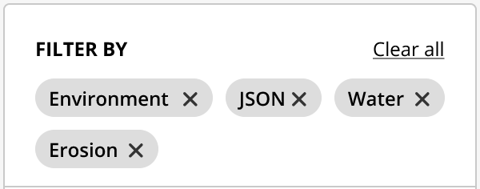
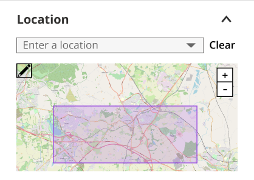
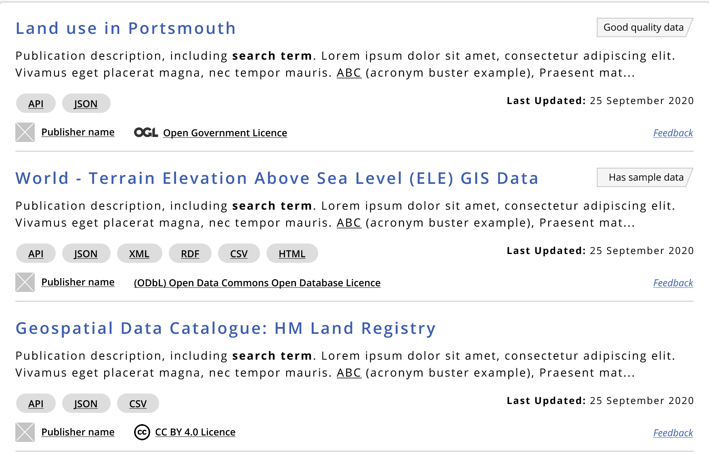

Help users to...

<h1 id="make-sense-of-search-results" style="margin-top: 0px">Make sense of search results</h1>

> Search results should be clearly presented with sufficient sorting and filtering options to help users refine and sort returned dataset records. It is important that users are given enough information to understand and identify relevant high-quality results quickly.

Faceted search allows users to refine search results through sorting (order of results), filtering (number of results) and categorisation (parent category). Sorting and filtering should be available to users at the time of entering keywords and not hidden or buried behind an "advanced search option". In addition, sorting and filtering are perceived as the same function and should therefore appear in the same part of the user interface.

Ensure users arrive at a 'search results' page after performing a search query from one of the search input methods. See [search for 
data](main-content/steps/search-for-data).

## What it looks like

!> A user's perception of dataset quality is driven by a number of different factors, such as publisher, publication date, frequency of updates, well-described metadata, how complete the data is and a clear visual presentation within the portal itself. 
 
For more information read how to help users to... [assess data quality](main-content/steps/assess-data-quality).

Search results should clearly answer:

+ Understand which results are relevant to the search query
+ Assess the likely data quality of each dataset presented
+ Refine, sort and filter search results to identify the most relevant datasets
+ Easily access more information about a single record

Ensure users are presented with enough information to help them identify when to change, refine or continue with their search query.

### 1. Number of results

Help users identify if results are too many or too few to indicate if a search requires additional filtering or refinement.

*Number of results on the search page*

### 2. Faceted search (by parent/child categories)

Ensure users have access to glanceable information regarding the parent topic or category to help identify [dataset quality](main-content/pages/assess-dataset-relevance) and [relevance](main-content/pages/assess-dataset-relevance).

*Faceted search*

### 3. Remove filters
Ensure users have effective tools to allow them to quickly remove applied filters.

*Search filters that can easily be removed*

### 4. Sort by
Ensure users have an effective way to change how results are sorted to help promote relevant results first.

*Dropdown for sorting search results*

### 5. Apply filters

Ensure users can quickly and easily apply filters to remove results that are not relevant to their search query.

*Search filters on search results page*

### 6. Geospatial filter

Geospatial presentation of results by preference of area should be made available for the user to refine their search to a specific location / spatial region.

*Geospatial filter on search results page. Map source: [OpenStreetMap](https://www.openstreetmap.org)*

### 7. Results list
Each result should show a title, description, related publisher information, publication date, last updated, key metadata and licence type. There may be additional mechanisms to help identify higher quality datasets, such as crowdsourced user feedback forms and displaying information to distinguish search results.

*Results list on search results page*

<!-- ### 8. Pagination - TO ADD -->
