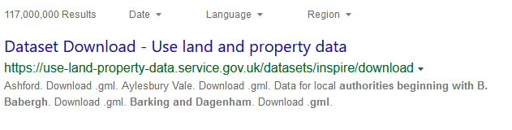

### Help users to
# Make sense of search results

> ...

...

...

!> ...

## What it looks like

...

*Google search results*

*Bing search results*

Essential components

 
Below is a checklist of components/information that are relevant for this task.

These components can be arranged in many ways, but the ones with highest relevance should be the most visible/accessible.

?> 1 - high relevance, 2 - medium relevance, 3 - low relevance

<!-- Table of component start -->

| Component             | Description                                                                                                     |  Relevance |
|-----------------------|-----------------------------------------------------------------------------------------------------------------|:----------:|
| Title                 | This will be the first thing that users see in search results, so it has to clear and descriptive. Title could also include the organisation who generated the dataset.                                                                                  |     1      |
| Description / Summary | Short description should be no longer than a few paragraphs, since users are likely to see only the first one or two sentences of this summary in the search results.   |     1      |

