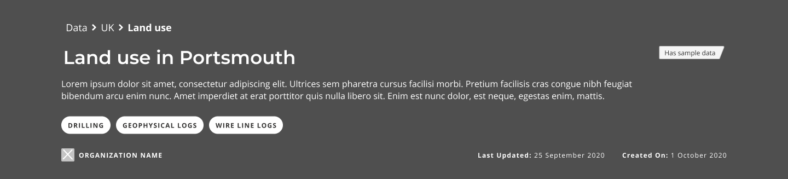

### Help users to
# Navigate the portal

> Users should always know where they are and have an easy way to jump to related content or back to the data portal homepage.

Homepage may not be the entry point to a data portal for many users, especially those who discover a specific dataset or search facility through direct links provided by search engine results. Thus it is important that they can easily make sense of where they are and how they can explore additional content.

## What it looks like

Here are some of the questions that should be answered when thinking about the overall site navigation as well as the navigation within a specific page:
* Does a page have a clear title?
* Does it have human readable breadcrumbs?
* Is there an easy way to get back to the homepage?
* If it's a dataset details page - is it possible to jump to the topic that this dataset belongs to?

*Navbar allows users to navigate back to homepage and other top level pages*

 

*Breadcrumbs allow users to easily jump to parent pages and see the website structure*

 

*Clear page heading help users make sense of where they are*

## Why/when to use this 'pattern'

Knowing where you are is essential on all the pages.

<a href="#/main-content/introduction?id=_2-search-within-data-portal" >View common painpoints/frustrations</a>

---

<!-- Additional information can be presented in dropdown menus -->

Essential components

 

Below is a checklist of components/information that are relevant for this task.

These components can be arranged in many ways, but the ones with highest relevance should be the most visible/accessible.

?> 1 - high relevance, 2 - medium relevance, 3 - low relevance

<!-- Table of component start -->

| Component      | Description                                              | Relevance |
|----------------|----------------------------------------------------------|:---------:|
| Page title     | A clear page title that can help users orient themselves |     1     |
| Breadcrumbs    | Breadcrumbs allowing users easily jump to parent folders |     1     |
| Navigation bar | Navigation bar including homepage link and search bar    |     1     |
