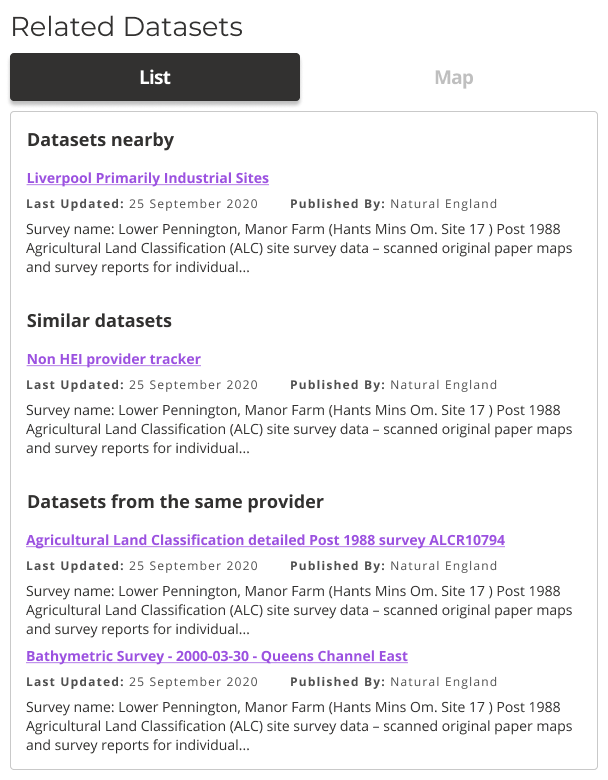

### Help users to
# Navigate the portal

> Users should always know where they are and have an easy way to jump to related content or back to the data portal homepage.

Homepage may not be the entry point to a data portal for many users, especially those who discover a specific dataset or search facility through direct links provided by search engine results. Thus it is important that they can easily make sense of where they are and how they can explore additional content.

## What it looks like

### 1. Pages should have clear, easy to find titles

The title should describe the contents of the page

*Page title*

### 2. Human readable breadcrumbs

Breadcrumbs allow users to easily jump to parent pages and see the website structure

*Example breadcrumbs*

### 3. Easy way to get back to the homepage

In case people get lost in the website structure, they should always be able to get back to homepage easily.

*Navbar allows users to navigate back to homepage and other top level pages*

### 4. Easy way to explore related content

Can users easily find related datasets or datasets that belong to the same topic?

*Related datasets*

### 5. Navigation should be consistent

* The titles should always be in the same place.
* Links should have the same style
* Breadcrumbs should have consistent structure.

## Why/when to use this 'pattern'

Knowing where you are is essential on all the pages.

<a href="#/main-content/introduction?id=_2-search-within-data-portal" >View common painpoints/frustrations</a>

---

<!-- Additional information can be presented in dropdown menus -->

Essential components

 

Below is a checklist of components/information that are relevant for this task.

These components can be arranged in many ways, but the ones with highest relevance should be the most visible/accessible.

?> 1 - high relevance, 2 - medium relevance, 3 - low relevance

<!-- Table of component start -->

| Component      | Description                                              | Relevance |
|----------------|----------------------------------------------------------|:---------:|
| Page title     | A clear page title that can help users orient themselves |     1     |
| Breadcrumbs    | Breadcrumbs allowing users easily jump to parent folders |     1     |
| Navigation bar | Navigation bar including homepage link and search bar    |     1     |

