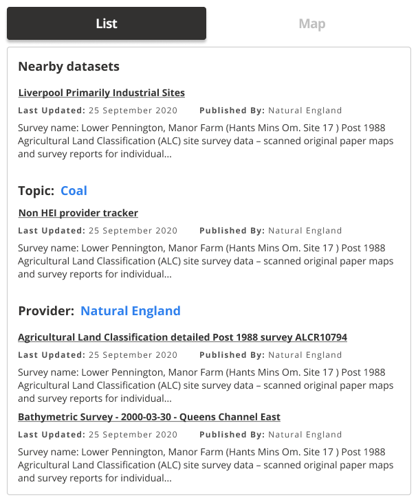

### Help users to
# Navigate the portal

> Users should always know where they are and have an easy way to jump to related content or back to the data portal homepage.

Homepage may not be the entry point to a data portal for many users, especially those who discover a specific dataset or search facility through direct links provided by search engine results. Thus it is important that they can easily make sense of where they are and how they can explore additional content.

## What it looks like

### 1. Page title

The title should describe the contents of the page

*Pages should have clear, easy to find titles*

### 2. Breadcrumbs

Breadcrumbs allow users to easily jump to parent pages and see the website structure

*Human readable breadcrumbs*

### 3. Fixed main navigation bar

The navigation bar should include the portal name, logo and the most important links. It allows users switching between tabs to know where they are and how to get to the most important pages on the portal.

*Navbar allows users to navigate back to homepage and other top level pages*

### 4. Navigate home

Similar to the point above - users should always be able to easily navigate back to homepage.

### 5. Consistent navigation

* The titles should always be in the same place.
* Links should have the same style
* Breadcrumbs should have consistent structure.

### 6. Related datasets

Showing related datasets on the [dataset details pages](/main-content/pages/dataset-details) can help users explore other datasets in the same region or from the same topic. These recommendations shouldn't be generic (e.g Latest Datasets), but should be relevant to what the users searched for.

If there is a risks for the *related datasets* lists becoming unwieldy, they should be split into groups according to topic, location or other relevant attribute.

List view             |  Map view
:-------------------------:|:-------------------------:
 | 

*Related datasets in list and map view*

## When to use

To be used on every page throughout the data portal and to highlight which page the user is currently on.

---

<!-- Additional information can be presented in dropdown menus -->

Essential components

 

Below is a checklist of components/information that are relevant for this task.

These components can be arranged in many ways, but the ones with highest relevance should be the most visible/accessible.

?> 1 - high relevance, 2 - medium relevance, 3 - low relevance

<!-- Table of component start -->

| Component      | Description                                              | Relevance |
|----------------|----------------------------------------------------------|:---------:|
| Page title     | A clear page title that can help users orient themselves |     1     |
| Breadcrumbs    | Breadcrumbs allowing users easily jump to parent folders |     1     |
| Navigation bar | Navigation bar including homepage link and search bar    |     1     |

