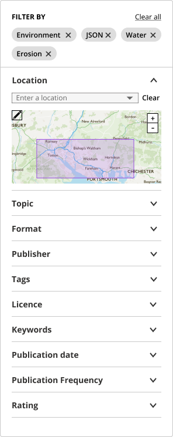

### Help users to
# Search for data

> Help users search for data within the data portal. 

some users prefer to search for data using keywords, some by specifying a location and seeing what datasets are available in the area, and some - using both methods.

Ideally the data portal should support both of these methods - keywords search and map search. An exemption could be small data portals serving a limited amount of datasets. In such cases (datasets with <20 datasets) search might not be required since all the datasets could be presented on a single page.

## What it looks like

### 1. Simple and detailed search

Ideally data portals should have both a *simple* search for users who are browsing datasets and a *detailed* search for users who know exactly what they are looking for.

<!-- tabs:start -->

#### **Simple search**

#### **Detailed search**

<!-- tabs:end -->

### 2. Display search field prominently

Search box should be easily noticeable. Since search is one of the primary functions of data portal, it should be accessible from any page of portal. A good place for it would be in the navigation bar.

*Search in the navigation bar*

### 3. Provide tips on what users can search for

Include a sample query in the search bar to suggest to users what they can search for.

*Search in the navbar*

### 4. Show search history

Show recent and most popular queries.

[TO DO - add an example]

### 5. Don't return no results

If the users query doesn't match any search results - provide an actionable message on what they could do differently.

[TO DO - add an example]

If some datasets have a 'near' match to search criteria they can be displayed as well

[TO DO - add an example]

### 6. Provide filtering and sorting options

if the initial search does not lead users to the dataset they are looking for, they should be able narrow down their search using filtering and sorting methods.

*Detailed search*

## Why/when to use this 'pattern'

* A simple search should be provided on the data portals landing page. 
* A more detailed and map search can be provided on separate pages.

## Related

* [Make sense of search results](main-content/steps/make-sense-of-search-results)
* [Common painpoints/frustrations](main-content/introduction#2-search-within-data-portal)

<!-- 
<a href="#/main-content/introduction?id=_2-search-within-data-portal" >Common painpoints/frustrations</a>
 -->

---

<!-- Additional information can be presented in dropdown menus -->

Essential components

 
[Brief description and a list of the most relevant components/information for this task]

Below is a checklist of components/information that are relevant for this task.

These components can be arranged in many ways, but the ones with highest relevance should be the most visible/accessible.

?> 1 - high relevance, 2 - medium relevance, 3 - low relevance

<!-- Table of component start -->

| Component       | Description                                                               | Relevance |
|-----------------|---------------------------------------------------------------------------|:---------:|
| Homepage search | Simple search on data portals homepage                                    |     1     |
| Navbar search   | A search bar that's accessible from any page                              |     2     |
| Detailed search | A more detailed search page with additional filtering and sorting options |     1     |
| Data filtering  | An option to filter search results                                        |     2     |
| Data sorting    | An option to sort data search reults                                      |     1     |

