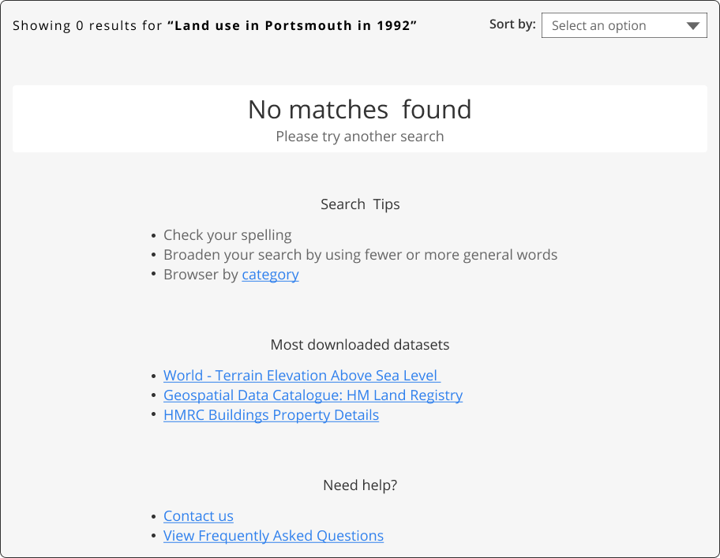

### Help users to
# Search for data

> Ensure users can search for data within your data portal by providing easy access to a search facility.

Users may search via a number of different methods. For example, by providing a keyword, specifying a location, or a combination of both.

Ideally your data portal should support both methods for searching by keywords and through a map search. Data portals with a small number of datasets could be exempt if those datasets all fit onto a single page or exist for one location only.

## What it looks like

### 1. Search field

Ensure users are able to search for data using keywords. As a primary function search fields should be easily recognisable and accessible from all pages. 
<!-- some confusion over the wording here -->

*Search field with sample search queries*

### 2. Advanced search

Ensure users can search by specifying more detailed criteria.

?> More details can be found in [*Make sense of search results*](main-content/steps/make-sense-of-search-results)

### 3. Spatial search

Give users multiple ways to search spatially for data:

* Using a post code / address
* Specifying coordinates
* Selecting an area of the map

Ensure it is clear to the user what is included in the search results and the coordinate system used.

*Spatial search. Map source: [OpenStreetMap](https://www.openstreetmap.org)*

If it's possible to search for datasets on a map, the search results should be combined with a list view for easier navigation.

*Search results on a map with a list view on a side. Map source: [OpenStreetMap](https://www.openstreetmap.org)*

Users often prefer to search for datasets using a map interface. When available, ensure it is discoverable and well integrated with regular searching and filtering methods. Allow users to easily switch between map view and list view on the *[search results page](search-and-results)*.

*Switching between map and list view. Map source: [OpenStreetMap](https://www.openstreetmap.org)*

### 4. Provide tips on what users can search for

Include a sample query in the search bar as a suggestion for users of what they can search for.

*Example search criteria*

### 5. Show search history

Show most recent or popular queries.

*Search history in the search bar*

### 6. Don't return 'no results'

If a user's query doesn't find any data records - provide an actionable message on what they could do differently.

If there are data records that have a 'close' resemblance to search criteria ensure they are displayed as suggestions.

*No results page with suggestions to improve the search*

### 7. Sort by and filter options

If a search query does not show any relevant data records ensure that query can be further refined through 'sort' and 'filter' methods.

### 8. Show users their search query on the results page

Ensure search queries are shown if entered to allow users to easily remember what they search for and adjust their search query if required.

*Search terms can be displayed on the results page, so that users don't have to remember what they searched for*

 

*Search terms should not get cleared from the search bar after search to make it easier to alter search terms if needed*

<!--
## When to use
Search functionality is important for data portals that have more datasets than can easily be presented on a single page.
### Example page
> **[Search / search results](main-content/pages/search-and-results)**
## Related
* [Make sense of search results](/main-content/steps/make-sense-of-search-results.md)
---
-->
<!-- Additional information can be presented in dropdown menus -->
<!--

Essential components

 
Below is a checklist of components/information that are relevant for this task.
These components can be arranged in many ways, but the ones with highest relevance should be the most visible/accessible.
?> 1 - high relevance, 2 - medium relevance, 3 - low relevance
-->
<!-- Table of component start -->
<!--
| Component       | Description                                                               | Relevance |
|-----------------|---------------------------------------------------------------------------|:---------:|
| Homepage search | Simple search on data portals homepage                                    |     1     |
| Navbar search   | A search bar that's accessible from any page                              |     2     |
| Detailed search | A more detailed search page with additional filtering and sorting options |     1     |
| Data filtering  | An option to filter search results                                        |     2     |
| Data sorting    | An option to sort data search reults                                      |     1     |

-->
