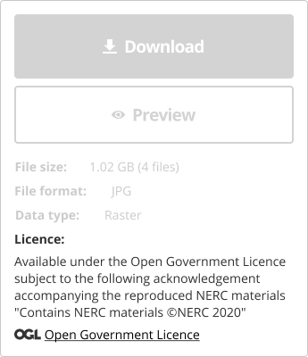

### Help users to
# Use data

> Help users download data in a format they prefer. The process for downloading data should be simple and straight-forward. If possible users should be able to select which files from the dataset they want to download. If not, it should be made clear what is included in the download file and how big the file size is.

Regardless of whether the dataset is freely available or requires payment, users prefer being able to preview the data online and to know any other requirements for using the dataset upfront.

The dataset would be usually downlaoded from the [dataset details page](/main-content/pages/dataset-details).

## What it looks like

### 1. Download button

Download link should be clearly visible on the dataset details page. If dataset is not available for download yet, it should be  indicated why and if/when the dataset will become available.

*Download panel on dataset details page*

### 2. Clear licencing information

If any licencing restrictions apply, they should be made clear upfront.

*License information*

### 3. Display data formats

Users should know what format the data is in before downloading it.

*Data formats*

### 4. API Access

If data can be accessed through an API, clear instructions how to do that should be easily accessible to users.

### 5. File selection for partial downloads

If possible, allow users to select which files in the dataset to download. If not, they should at least know what is included in the download file

*Option to select and preview the files included in the dataset*

### 6. Sharing options

User might want to share links with colleagues or send a link to themselves for later use.

*Dataset sharing options*

---

<!-- Additional information can be presented in dropdown menus -->

Essential components

 

Below is a checklist of components/information that are relevant for this task.

These components can be arranged in many ways, but the ones with highest relevance should be the most visible/accessible.

?> 1 - high relevance, 2 - medium relevance, 3 - low relevance

<!-- Table of component start -->

| Component       | Description                                                    | Relevance |
|-----------------|----------------------------------------------------------------|:---------:|
| Download button | Download link or instructions how to access data               |     1     |
| Data formats    | What formats is the data provided in?                          |     1     |
| Sharing options | Share, email or copy the dataset url                           |     2     |
| Data preview    | Preview all or parts of a dataset online before downloading it |     2     |
| Licence details | Are there any limitation on how the data can be used?          |     1     |

