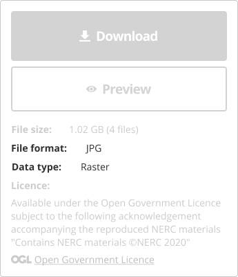
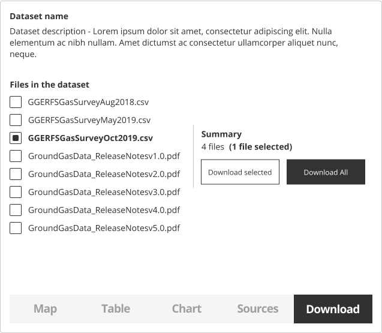
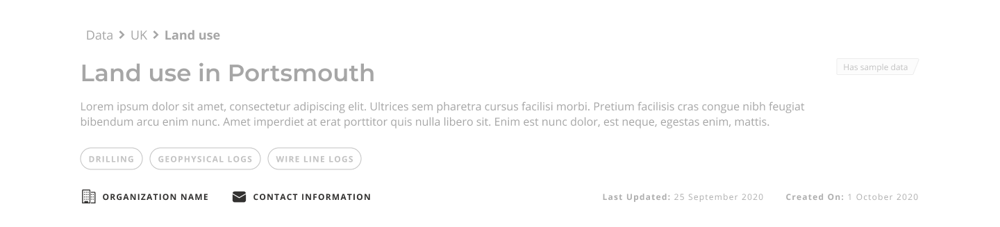

Help users to...

<h1 id="use-data" style="margin-top: 0px">Use data</h1>

> Help users to download data in the format they prefer. Make sure this download process is simple and straight-forward. Where possible, allow for the partial download of datasets. Ensure the contents of the dataset are made clear, the size of the download and what formats are included.

State whether a dataset is freely available, subject to any use contraints, licences or fees. Users prefer having the option to preview data prior to download, with information describing what is required to use the dataset. For more information read how to help users to... [explore data online](main-content/steps/explore-data-online).

Ensure datasets are downloadable from their [dataset details page](/main-content/pages/dataset-details).

## What it looks like

### 1. Preview data online

Make sure datasets can be assessed directly in the portal. Read more about it in the ['Explore data online'](/main-content/steps/explore-data-online) section. 

### 2. Straightforward process for downloading data

Restricting access to datasets can often lead to user frustration [(Data Discoverability project, 2020](https://www.gov.uk/government/publications/finding-geospatial-data/finding-geospatial-data)). Ensure the data download process is as simple as possible. If there are additional steps required to access data, they should be made accessible to the user, with clear instructions.

### 3. Download button

Download buttons and links for datasets should be clearly visible and identifiable. Any datasets that are not available for download (e.g. those undergoing review for publication), should be described as such with information about when the dataset will become available.

The use of icons will help users recognise download links. If icons are used, they should be simple and always include a text label.

*Download panel on dataset details page*

### 4. Clear licencing information

If any licencing restrictions apply, they should be made clear upfront with links to further information where appropriate.

*License information*

### 5. Display data formats

Ensure users know what format the data is in before downloading, ideally with access to definitions of those file types. Users are usually looking for data that can work with the tools they use.

*Data formats*

### 6. Dynamic data access

If data can be accessed through other methods, clear instructions on how to do that should be provided. For example, users may prefer to access data in a flexible way, such as through an application programming interface (API). If providing API’s, consider whether to apply usage limits and security. It is also important for a portal to provide information on the expected availability of the API (e.g. 99.9% uptime). This helps teams work out how they can best make use of a shared API. 

### 7. File selection for partial downloads

Where possible, allow users to select files from a dataset for a partial download. Datasets should be described with information about what is included.

*Option to select and preview the files included in the dataset*

### 8. Contact information

Some users might have questions about a specific dataset. They could arise before or after downloading it. If contact information of people who could answer these questions is available, it should be easily findable on the dataset details page and it should be included in the data download.

*Contact information for a dataset*

### 9. Sharing options

A user might want to share links with colleagues or send a link to themselves for later use.

*Dataset sharing options*

<!-- 
---

Essential components

 

Below is a checklist of components/information that are relevant for this task.

These components can be arranged in many ways, but the ones with highest relevance should be the most visible/accessible.

?> 1 - high relevance, 2 - medium relevance, 3 - low relevance

| Component       | Description                                                    | Relevance |
|-----------------|----------------------------------------------------------------|:---------:|
| Download button | Download link or instructions how to access data               |     1     |
| Data formats    | What formats is the data provided in?                          |     1     |
| Sharing options | Share, email or copy the dataset url                           |     2     |
| Data preview    | Preview all or parts of a dataset online before downloading it |     2     |
| Licence details | Are there any limitation on how the data can be used?          |     1     |

 -->
